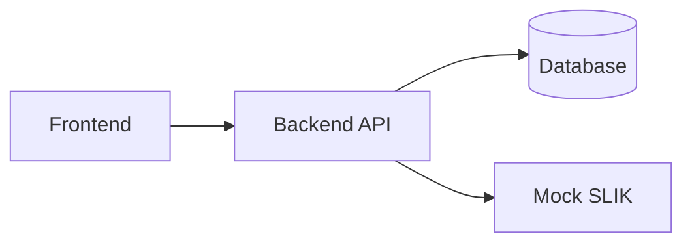

# iMitra — Sistem Originasi Pembiayaan Mikro Syariah

> **Berkas ini adalah TEMPLATE.** Setiap blok `<!-- ISI: ... -->` adalah placeholder yang wajib
> Anda ganti. Jangan biarkan satu pun `<!-- ISI: ... -->` tersisa di tag `v1.0.0` — penilai
> membaca README ini lebih dulu, sebelum menjalankan aplikasi Anda.
>
> Aturan praktis: kalau penilai tidak bisa menjalankan aplikasi Anda hanya dengan membaca
> berkas ini, aplikasi Anda dianggap tidak jalan.

---

## 1. Tim

<!-- ISI: nama tim. Bebas, tapi dipakai konsisten di semua dokumen dan di nama repo. -->

**Nama tim**: iMitra Tim 1

<!-- ISI: tabel di bawah. Satu baris per anggota. Peran diambil dari §10 brief:
     Tech Lead / Integrator, AI Workflow Officer, Backend Engineer, Frontend Engineer,
     QA / Verification, DevOps / Release. Semua peran ikut menulis kode.
     Kolom "Fokus FR" diisi ID FR yang menjadi tanggung jawab utamanya (mis. FR-05, FR-06).
     Isi tabel ini dalam 30 menit pertama dan beri tahu instruktur. -->

| Nama | Peran | Fokus FR | Akun GitHub |
|---|---|---|---|
| Luthfi | Tech Lead / Integrator | FR-08, FR-09 | `<!-- ISI: URL akun -->` |
| Irgiyansyah | Backend Engineer — domain & skoring + DevOps / Release | FR-06, FR-07, FR-13, CI & compose | https://github.com/irgiys/ |
| Yulio Zaki | Backend Engineer — auth & integrasi SLIK | FR-01, FR-05, mock SLIK | https://github.com/yuliozakik |
| Rayvaldo | Backend Engineer — pengajuan & dokumen | FR-02, FR-03, FR-04 | https://github.com/rayvaldoprawira |
| Aldi | AI Workflow Officer + Frontend Engineer | FR-03/FR-04/FR-08 (UI), FR-11 | https://github.com/aldiariq/ |
| Soleh | QA / Verification | FR-12, test AC-01…AC-15 | https://github.com/mshcode89 |

**Pembagian tanggung jawab non-koding** (satu berkas = satu pemilik tunggal; orang lain
mengusulkan lewat PR, supaya tidak ada konflik merge pada tabel markdown):

| Pemilik | Berkas yang dimiliki | Lapisan kode yang dimiliki |
|---|---|---|
| Luthfi (Tech Lead) | `AGENTS.md`, `docs/adr/`, memutus saat tim berdebat > 5 menit, merge PR | `internal/service/approval_service.go`, `audit_service.go` |
| Irgiyansyah | `docs/SDD-iMitra.md` (BAB 4 model data, BAB 5 endpoint), `docker-compose.yml`, `.github/workflows/ci.yml`, `.env.example` | `internal/service/skoring_service.go`, `margin_service.go`, tabel parameter, `backend/migrations/` |
| Yulio Zaki | `docs/SRS-iMitra.md` | `internal/httpapi/` middleware auth+peran, `internal/slik/`, `mock-slik/` |
| Rayvaldo | Kontrak API di SDD BAB 5 bersama Irgiyansyah | `internal/service/pengajuan_service.go`, `internal/repository/` |
| Aldi | `docs/AI-WORKFLOW.md`, `docs/AI-DEVLOG.md` (kontributor: semua anggota) | `frontend/app/`, `frontend/components/`, `frontend/lib/` |
| Soleh | `README.md`, `docs/DEMO-SCRIPT.md`, `docs/TRACEABILITY.md` | `*_test.go`, `backend/test/` |

Tim berisi 6 orang, jadi mengikuti bentuk **Tim 2** pada brief §10: peran DevOps / Release
dirangkap oleh salah satu Backend Engineer (Irgiyansyah), bukan oleh QA. Alasannya: DevOps
memiliki `docker-compose.yml`, `ci.yml`, dan migrasi — ketiganya paling sering rusak justru
karena perubahan di backend, jadi lebih murah dipegang orang yang menulis backend. QA
(Soleh) dibiarkan **murni sebagai penjaga gerbang**: kalau QA juga yang menulis CI, ia
menjadi pemeriksa atas pekerjaannya sendiri — pola yang persis kita larang di BR-09.
Semua peran, termasuk Tech Lead dan AI Workflow Officer, tetap ikut menulis kode.

**Pembagian frontend (`frontend/app/`, Next.js 14 App Router)**

Bentuk Tim 2 pada brief §10 hanya menyediakan satu Frontend Engineer, sedangkan UI iMitra
mencakup 6 peran. Kalau seluruh UI ditumpuk ke satu orang, ia menjadi penghambat semua FR
pada jam-jam terakhir. Karena itu pembagiannya **vertikal**: pemilik aturan bisnis sebuah FR
juga menulis UI untuk FR itu, memakai komponen bersama yang disiapkan Aldi. Aldi tetap
pemilik `frontend/` — ia yang menyiapkan fondasi lebih dulu dan me-review PR frontend orang
lain supaya gaya dan pemakaian komponen tetap konsisten.

| Route / bagian UI | Peran pemakai | Penulis | FR | Kapan |
|---|---|---|---|---|
| Fondasi: `app/layout.tsx`, `lib/apiClient.ts`, `lib/auth.ts`, guard peran sisi klien, komponen bersama (`Table`, `StatusBadge`, `FormField`, `ErrorAlert`) | semua | **Aldi** | — | **Kamis paling awal** — semua route lain menunggu ini |
| `app/login` + penyimpanan sesi/token | semua | **Aldi** | FR-01 | Kamis (walking skeleton) |
| `app/(ao)/pengajuan/baru` — form pengajuan | AO | **Rayvaldo** | FR-02 | Kamis (walking skeleton) |
| `app/(ao)/pengajuan` — daftar pengajuan milik AO | AO | **Rayvaldo** | FR-02 | Kamis (walking skeleton) |
| `app/(ao)/pengajuan/[id]/dokumen` — upload & re-upload satu dokumen | AO | **Rayvaldo** | FR-03 | Kamis–Jumat |
| `app/(ao)/pengajuan/[id]/survei` — form survei (koordinat, foto, omzet) | AO | **Aldi** | FR-04 | Kamis–Jumat |
| `app/(anl)/pengajuan/[id]/verifikasi` — verifikasi dokumen + kode alasan tolak | ANL | **Rayvaldo** | FR-03 | Jumat pagi |
| `app/(anl)/pengajuan/[id]/slik` — tombol SLIK check + tampilan hasil & jalur error | ANL | **Yulio Zaki** | FR-05 | Jumat pagi |
| `app/(anl)/pengajuan/[id]/skoring` — **rincian kontribusi tiap komponen** + form override | ANL | **Irgiyansyah** | FR-06 | Jumat pagi |
| `app/(anl)/pengajuan/[id]/margin` — hitung margin/nisbah + tampilan blokir BR-06 | ANL | **Irgiyansyah** | FR-07 | Jumat pagi |
| `app/(approval)/pengajuan/[id]` — kartu keputusan APPROVE / REJECT / RETURN + alasan | KCP, KC, KOM | **Luthfi** | FR-08 | Jumat pagi |
| `app/(anl)/pengajuan/[id]/audit` — tampilan audit trail (read-only) | ANL, approver | **Luthfi** | FR-09 | Jumat pagi |
| `app/dashboard` — pipeline per status, jumlah per tahap, filter per peran | semua | **Soleh** | FR-12 | Jumat, setelah P0 |
| `app/(adm)/parameter` — CRUD bobot skor, ambang approval, rentang margin | ADM | **Irgiyansyah** | FR-13 | Jumat, setelah P0 |
| Notifikasi in-app | semua | **Aldi** | FR-11 | Jumat, setelah P0 |

**Hak akses & review di GitHub**

| Nama | Akses repo | Peran di alur PR |
|---|---|---|
| Luthfi | Write | Tech Lead — approver & **satu-satunya yang me-merge** ke `main` |
| Irgiyansyah | Write | **Approver** (review + approve PR anggota lain), DevOps / Release — pemilik CI, compose, migrasi, dan yang men-tag `v1.0.0` |
| Yulio Zaki | Write | Reviewer bidang auth/SLIK, pemilik `docs/SRS-iMitra.md` |
| Rayvaldo | Write | Reviewer bidang pengajuan/dokumen |
| Aldi | Write | Reviewer seluruh PR `frontend/` |
| Soleh | Write | QA — **gerbang terakhir sebelum merge** (test & lint benar-benar lolos), tidak memiliki CI supaya tidak memeriksa pekerjaannya sendiri |
| Muhammad Harum Alrasyid (instruktur) | Write | Penilai; membuka issue saat cross-review Jumat 16.05 |

Batas yang berlaku untuk approver, mengikuti brief §8.2 dan `AGENTS.md` bagian 4.2:

- **Tidak ada yang menyetujui PR-nya sendiri**, termasuk Tech Lead dan approver. Ini cermin
  git dari BR-09 (maker ≠ checker) — kalau kontrol itu kita tegakkan di aplikasi, kita juga
  menegakkannya pada diri sendiri.
- Setiap PR butuh **minimal 1 approval dari anggota lain**, dan approval hangus kalau ada
  commit baru (`Dismiss stale approvals` aktif di branch protection).
- Approver **tidak boleh** meloloskan PR dengan CI merah atau test yang dilemahkan
  (`AGENTS.md` Larangan 7). Kalau test gagal, yang salah kode atau requirement-nya.
- Dua approver (Luthfi & Irgiyansyah) supaya PR tidak menganggur saat satu orang sedang
  fokus koding — bukan supaya review bisa dilewati.
- Kepemilikan per path didaftarkan di [`.github/CODEOWNERS`](.github/CODEOWNERS) sehingga
  GitHub otomatis meminta review dari orang yang paham konsekuensinya.

Aturan yang berlaku untuk seluruh frontend:

- **Tidak ada aturan bisnis di frontend.** Skoring, margin, routing approval, dan seluruh
  guard BR dihitung di `backend/internal/service/` (`AGENTS.md` bagian 3 dan Larangan 17).
  UI hanya menampilkan hasil dan pesan error dari API.
- **Menyembunyikan tombol bukan otorisasi.** Guard peran di UI sekadar kenyamanan; penolakan
  yang dinilai (AC-02) adalah 403 dari server (`AGENTS.md` Larangan 6).
- **Nomor referensi tidak dibangkitkan di frontend** (`AGENTS.md` Larangan 4).
- **NIK dan path foto tidak boleh masuk URL** — pakai id internal pengajuan (BR-11).
- Pesan error diambil dari field `message` respons API, jangan disusun ulang di UI, supaya
  pesan yang menyebut kode BR (AC-04) tidak hilang.
- Semua panggilan API lewat `lib/apiClient.ts`; jangan ada `fetch()` telanjang di komponen.

<!-- ISI: kalau peran berubah di hari kedua, catat perubahannya di sini beserta alasan
     dan jam perubahannya. Perubahan peran tidak dilarang; perubahan yang tidak dicatat
     yang jadi masalah. -->

**Perubahan peran selama hackathon**:

| Jam | Perubahan | Alasan |
|---|---|---|
| 2026-08-20 11:10 | Peran **DevOps / Release** pindah dari Soleh (QA) ke **Irgiyansyah**, beserta kepemilikan `ci.yml`, `docker-compose.yml`, `.env.example`, dan `backend/migrations/` | QA dibiarkan murni sebagai penjaga gerbang. Kalau QA juga yang menulis CI, ia menjadi pemeriksa atas pekerjaannya sendiri — pola yang persis kita larang di BR-09 (maker ≠ checker). Dicatat di `AGENTS.md` riwayat baris 11:10 |
| 2026-08-20 17:10 | Tabel di atas dan `docs/AI-WORKFLOW.md` disesuaikan agar mencerminkan perubahan 11:10 | Ketiga dokumen sebelumnya tidak sinkron: `AGENTS.md` sudah memindahkan DevOps ke Irgiyansyah sejak 11:10, tetapi README dan AI-WORKFLOW masih mencantumkan "CI & compose" sebagai tugas Soleh. Ditemukan saat audit QA atas tugas yang belum dikerjakan |

---

## 2. Cara Menjalankan

<!-- ISI: Target wajib (§7.2 butir 1): penilai melakukan git clone di mesin bersih,
     menjalankan SATU perintah, dan aplikasi hidup. Uji ini sendiri dari direktori
     kosong minimal sekali sebelum Gate 2 dan sekali lagi sebelum code freeze.
     Jangan tulis langkah yang belum pernah Anda jalankan dari clone bersih. -->

### 2.1 Prasyarat

<!-- ISI: daftar prasyarat beserta versi minimum. Contoh format:
     - Docker Engine >= 24 dan Docker Compose v2
     - (kalau tanpa Docker) runtime bahasa X versi Y -->

- `<!-- ISI: prasyarat 1 -->`
- `<!-- ISI: prasyarat 2 -->`

### 2.2 Langkah

```bash
git clone <!-- ISI: URL repo -->
cd <!-- ISI: nama direktori -->
cp .env.example .env
<!-- ISI: satu perintah untuk menjalankan, mis. docker compose up --build -->
```

### 2.3 Alamat layanan setelah jalan

<!-- ISI: sesuaikan port dengan .env.example Anda. -->

| Layanan | URL | Catatan |
|---|---|---|
| Frontend | `<!-- ISI -->` |  |
| Backend API | `<!-- ISI -->` |  |
| Mock SLIK | `<!-- ISI -->` |  |
| Database | `<!-- ISI -->` |  |

### 2.4 Migrasi & seed

<!-- ISI: perintah migrasi dan seed. Wajib idempoten — bisa dijalankan berulang tanpa error
     (§7.2 butir 4 dan 5). Sebutkan juga cara MERESET demo ke kondisi awal, karena penilai
     mungkin meminta demo diulang. -->

```bash
<!-- ISI: perintah migrasi -->
<!-- ISI: perintah seed -->
<!-- ISI: perintah reset -->
```

### 2.5 Akun demo

Keenam akun di bawah dibuat oleh `backend/cmd/seed` (idempoten, aman dijalankan ulang) dan
otomatis tersedia setelah `docker compose up` — service `migrate` menjalankan migrasi lalu seed
sebelum backend start, jadi tidak ada langkah manual.

Password di bawah bukan rahasia: akun ini hanya ada di lingkungan demo, dan nilainya berasal
dari `SEED_DEFAULT_PASSWORD` di `.env`. Tidak ada secret nyata (JWT secret, kredensial DB,
token API) yang ditulis di berkas ini.

**Login memakai EMAIL, bukan username.** Field JSON-nya `email`
(`backend/internal/httpapi/auth_handler.go`); mengirim `username` dijawab
`400 VALIDATION_ERROR "email dan password wajib diisi"`.

| Peran | Email | Password | Nama tampilan | Dipakai untuk AC |
|---|---|---|---|---|
| AO | `ao@imitra.test` | `Demo1234!` | Ayu Account Officer | AC-01, AC-02, AC-03 |
| ANL | `anl@imitra.test` | `Demo1234!` | Andi Analis Mikro | AC-03, AC-04, AC-06, AC-07, AC-08, AC-09 |
| KCP | `kcp@imitra.test` | `Demo1234!` | Kartika Kepala CP | AC-10, AC-11 |
| KC | `kc@imitra.test` | `Demo1234!` | Kurnia Kepala Cabang | AC-10 |
| KOM | `kom@imitra.test` | `Demo1234!` | Komite Pembiayaan | AC-10 |
| ADM | `adm@imitra.test` | `Demo1234!` | Admin Sistem | AC-15 |

Verifikasi cepat bahwa keenamnya benar-benar bisa login (dijalankan terhadap stack yang hidup):

```bash
for e in ao anl kcp kc kom adm; do
  printf '%-4s -> %s\n' "$e" "$(curl -s -X POST http://localhost:8080/api/auth/login \
    -H 'Content-Type: application/json' \
    -d "{\"email\":\"$e@imitra.test\",\"password\":\"Demo1234!\"}" \
    | grep -o '"peran":"[^"]*"' | cut -d'"' -f4)"
done
```

Keluaran yang diharapkan: `ao -> AO`, `anl -> ANL`, `kcp -> KCP`, `kc -> KC`, `kom -> KOM`,
`adm -> ADM`. Baris yang kosong berarti login gagal — periksa apakah service `migrate` sudah
selesai (`docker compose logs migrate`).

**Catatan untuk penilai — apa yang sudah bisa dicoba lewat UI.** UI saat ini memiliki
`/login`, `/pengajuan` (AO/ANL/approver), dan `/approval` (KCP/KC/KOM/ANL). Masuk sebagai ADM
masih diarahkan ke `/parameter` yang **belum ada**, sehingga FR-13 hanya dapat diperiksa lewat
API. Dua batasan yang perlu diketahui sebelum mencoba:

- **Daftar pengajuan untuk ANL/approver masih kosong.** `GET /api/pengajuan` masih selalu
  memakai `DaftarMilikAO`, jadi hanya AO yang melihat isinya. Layar `/approval` karena itu
  membuka pengajuan **per id**, bukan lewat daftar — id-nya bisa diambil dari layar
  `/pengajuan` saat login sebagai AO, atau dari audit trail.
- **Skoring belum bisa dijalankan lewat UI.** Untuk mencapai status `SCORED` (prasyarat
  `ajukan-approval`), jalankan skoring lewat API. Alurnya: SLIK check (FR-05, endpointnya belum
  ada) → skoring → ajukan approval.

Status jujur per FR ada di tabel bagian 4.

### 2.6 Test & lint

<!-- ISI: perintah persis. Harus sama dengan yang dipakai di .github/workflows/ci.yml
     dan yang tertulis di AGENTS.md. Kalau ketiganya berbeda, salah satunya sudah usang. -->

```bash
<!-- ISI: perintah test -->
<!-- ISI: perintah lint -->
```

---

## 3. Arsitektur Singkat

<!-- ISI: 5-10 baris prosa, bukan lebih. Jelaskan: komponen apa saja, siapa memanggil siapa,
     di mana aturan bisnis ditegakkan, dan bagaimana otorisasi bekerja di server.
     Detail lengkapnya ada di docs/SDD-iMitra.md — jangan duplikasi, cukup rujuk. -->

`<!-- ISI: deskripsi arsitektur -->`

<!-- ISI: diagram arsitektur. Mermaid inline diterima dan disarankan karena ikut ter-render
     di GitHub. Diagram harus benar-benar ADA — tulisan "diagram terlampir" dinilai sebagai
     tidak ada. Hapus contoh di bawah dan gambar arsitektur Anda sendiri. -->



**Stack yang dipilih**: `<!-- ISI: bahasa, framework, database, ORM -->`
Alasan pemilihan ada di [`docs/adr/0001-pilihan-stack.md`](docs/adr/0001-pilihan-stack.md).

**Aturan untuk AI agent**: [`AGENTS.md`](AGENTS.md)

---

## 4. Status Functional Requirements

<!-- Kolom FR / Requirement / Prioritas pre-isi dari brief §3 — jangan diubah, penilai
     mencocokkannya.

     Nilai Status yang diizinkan pada tag v1.0.0, pilih satu:
       - Selesai & teruji  : lolos AC terkait, ada test otomatis, sudah di-merge ke main
       - Selesai           : jalan dan di-merge, tetapi belum ada test otomatis
       - Sebagian          : hanya sebagian AC terpenuhi. WAJIB dijelaskan di bagian 5
       - Tidak dikerjakan  : sengaja dibuang. WAJIB dijelaskan di bagian 5

     "Belum mulai" di bawah adalah status SEMENTARA selama pengerjaan, bukan nilai yang
     boleh bertahan sampai tag v1.0.0 — pada saat itu tidak ada lagi yang sedang jalan.

     Aturan pengisian yang kami sepakati (QA): sebuah baris hanya boleh "Selesai & teruji"
     kalau endpoint/layarnya benar-benar terdaftar DAN ada test yang menguji AC-nya. Kalau
     hanya service-nya siap tetapi endpoint belum ada, itu "Sebagian" — bukan "Selesai".

     Siapa yang mengisi: setiap orang memperbarui baris FR-nya saat PR-nya di-merge
     (AGENTS.md bagian 7, checklist sebelum membuka PR), bukan QA di akhir. Kolom PR diisi
     nomor PR yang benar-benar me-merge commit-nya ke main — periksa dengan
     `git log --merges --ancestry-path <commit>..origin/main`, jangan menebak. -->

### P0 — WAJIB (batas lulus fungsional)

| FR | Requirement | Prioritas | Status | PR |
|---|---|---|---|---|
| FR-01 | Autentikasi & Otorisasi Berbasis Peran | P0 | Sebagian | #6 |
| FR-02 | Pengajuan Pembiayaan Mikro | P0 | Sebagian | (branch `Rayvaldo`) |
| FR-03 | Upload & Verifikasi Dokumen | P0 | Belum mulai | — |
| FR-04 | Survei Lapangan (OTS) | P0 | Belum mulai | — |
| FR-05 | SLIK Check | P0 | Belum mulai | (branch `branch-yulio`) |
| FR-06 | Skoring Kelayakan Mikro | P0 | Sebagian | #4 |
| FR-07 | Perhitungan Margin / Nisbah | P0 | Sebagian | #4 |
| FR-08 | Approval Berjenjang | P0 | Selesai & teruji | #8 |
| FR-09 | Audit Trail | P0 | Selesai & teruji | #8 |

### P1 — SEHARUSNYA (nilai penuh butuh ini)

| FR | Requirement | Prioritas | Status | PR |
|---|---|---|---|---|
| FR-10 | Pembiayaan Kelompok (Majelis) | P1 | Belum mulai | — |
| FR-11 | Notifikasi Perubahan Status | P1 | Belum mulai | — |
| FR-12 | Dashboard Pipeline | P1 | Belum mulai | — |
| FR-13 | Parameter Terkonfigurasi | P1 | Sebagian | #4 |

### P2 — BOLEH (hanya kalau P0 dan P1 tuntas dan teruji)

| FR | Requirement | Prioritas | Status | PR |
|---|---|---|---|---|
| FR-14 | Simulasi angsuran murabahah & proyeksi bagi hasil musyarakah | P2 | Tidak dikerjakan | — |
| FR-15 | Ekspor daftar pengajuan ke CSV | P2 | Tidak dikerjakan | — |
| FR-16 | Mode draft offline untuk AO di lapangan | P2 | Tidak dikerjakan | — |
| FR-17 | Deteksi lokasi palsu (mock location) pada survei lapangan | P2 | Tidak dikerjakan | — |
| FR-18 | Laporan Turn-Around Time per tahap dan per petugas | P2 | Tidak dikerjakan | — |

**Dasar penilaian status di atas** (diverifikasi QA terhadap kode di `main`, bukan dari rencana —
lihat `docs/TRACEABILITY.md` untuk penelusuran per AC dan per BR):

| FR | Yang sudah ada | Yang belum |
|---|---|---|
| FR-01 | Fondasi frontend: `app/login`, `lib/auth.ts`, `lib/apiClient.ts`, `components/GuardPeran.tsx` | **Endpoint login & middleware peran di server belum ada.** Guard di UI bukan otorisasi (`AGENTS.md` Larangan 6), jadi AC-02 (403 dari API) belum bisa dibuktikan |
| FR-02 | `service/pengajuan_service.go`: nomor referensi `IMT-YYYYMMDD-NNNN` (BR-12) + batas plafon (BR-01), 8 test | Endpoint `POST /api/pengajuan` belum ada; repository nomor referensi masih fake |
| FR-05 | — | `internal/slik/` dan `mock-slik/` belum ada, sehingga jalur error E-1 (503) dan E-2 (404) belum bisa didemokan |
| FR-06 | `skoring_service.go` + `skoring_komponen.go`, rincian 4 komponen (BR-08), 8 test termasuk AC-06/AC-07 | Endpoint skoring & layar ANL belum ada. Rincian komponen **belum tersimpan** — tabel `komponen_skor` belum ada di migrasi |
| FR-07 | `margin_service.go`, blokir margin di luar rentang (BR-06), 6 test termasuk AC-09 | Endpoint perhitungan margin belum ada |
| FR-08 | 3 endpoint approval, routing berjenjang (BR-02), maker≠approver (BR-09), 6 test | Layar approval di frontend belum ada |
| FR-09 | 2 endpoint audit (append-only, tanpa PUT/PATCH/DELETE), 4 test termasuk AC-13 | Layar audit trail di frontend belum ada |
| FR-13 | Tabel `parameter_skoring`, `ambang_approval`, `rentang_margin`, `parameter_umum` + seed idempoten; nilai dibaca dari data setiap kali hitung (AC-15 terbukti lewat test) | Endpoint CRUD ADM dan layar `app/(adm)/parameter` belum ada |

Nilai `Belum mulai` tidak ada dalam daftar status yang diizinkan untuk tag `v1.0.0`. Sebelum
code freeze, setiap baris `Belum mulai` **wajib** berubah menjadi `Sebagian`, `Selesai`, atau
`Tidak dikerjakan` dengan penjelasan di bagian 5 — meninggalkannya apa adanya bernilai negatif
(brief §11 Gate 3 dan §12).

Penelusuran rinci FR → endpoint → test → PR ada di [`docs/TRACEABILITY.md`](docs/TRACEABILITY.md).

---

## 5. Tidak Diimplementasikan dan Mengapa

> **Bagian ini wajib ada dan wajib terisi.** Ia bukan pengakuan kegagalan — ia bukti bahwa
> tim memutuskan secara sadar.
>
> Kenapa penting: menurut brief §11 (Gate 3) dan §12, **fitur setengah jadi yang dibiarkan
> mengambang tanpa catatan bernilai negatif (−5 per fitur, maksimum −10), sementara fitur
> yang dibuang dengan alasan tertulis bernilai positif.** Membuang FR-14 dengan alasan
> "P0 belum semua teruji, kami pilih memperkuat FR-06" adalah keputusan rekayasa dan
> dinilai sebagai keahlian. Meninggalkan tombol yang tidak berfungsi tanpa penjelasan
> adalah utang yang tidak diakui.
>
> Tulis bagian ini pada Gate 3 (Jumat 11.20), bukan pada Jumat 14.55.

<!-- Diisi bertahap: draf pada Gate 2 (Kamis 15.30) supaya keputusan membuang diambil
     dengan sadar dan masih ada waktu meninjaunya, lalu DIKUNCI pada Gate 3 (Jumat 11.20).
     Kolom "Diputuskan kapan" wajib menunjukkan kapan keputusan itu benar-benar diambil.

     Aturan yang kami pakai saat mengisi:
     - FR P0 TIDAK BOLEH berkeputusan "Dibuang" — P0 adalah batas lulus fungsional
       (brief §3). Kalau P0 belum jadi, keputusannya "Sebagian" beserta apa yang belum,
       bukan dibuang.
     - "Sebagian" wajib menyebut dengan tepat apa yang jalan dan apa yang tidak, supaya
       penilai tidak menemukannya sendiri saat demo.
     - Alasan wajib berupa alasan rekayasa (prioritas, risiko, dependensi), bukan
       "kehabisan waktu" tanpa keterangan. -->

> **Status bagian ini: DRAF Gate 2 (Kamis 15.30).** Baris P2 di bawah sudah merupakan
> keputusan tim; baris P0 masih berupa penilaian keadaan per Kamis dan **wajib ditinjau
> ulang pada Gate 3 (Jumat 11.20)**, karena masih ada sesi kerja Jumat pagi. Yang tidak
> boleh terjadi: baris P0 di bawah dibiarkan apa adanya sampai code freeze tanpa ditinjau.

| FR / Bagian | Keputusan | Apa yang jalan | Apa yang tidak | Alasan | Diputuskan kapan |
|---|---|---|---|---|---|
| **FR-14** Simulasi angsuran & proyeksi bagi hasil | **Dibuang** | — | Seluruhnya | P2, dan tidak dirujuk AC mana pun. Menambah permukaan perhitungan finansial baru sementara BR-08 (rincian skor belum tersimpan) dan BR-11 (NIK di log belum ditegakkan) masih terbuka justru menaikkan risiko di area yang dinilai. Kami memilih memperkuat FR-06/FR-07 yang sudah punya test | Kamis 15.30 (Gate 2) |
| **FR-15** Ekspor daftar pengajuan ke CSV | **Dibuang** | — | Seluruhnya | P2. Ekspor data pengajuan berisiko langsung terhadap BR-11 (NIK tidak boleh keluar ke berkas/URL), dan penegakan BR-11 belum ada. Membangun jalur ekspor sebelum kontrol datanya ada adalah urutan yang salah untuk aplikasi perbankan | Kamis 15.30 (Gate 2) |
| **FR-16** Mode draft offline untuk AO | **Dibuang** | — | Seluruhnya | P2. Butuh penyimpanan lokal + strategi sinkronisasi + resolusi konflik — pekerjaan berhari-hari, bukan berjam-jam. Tidak realistis dalam sisa waktu dan tidak dirujuk AC mana pun | Kamis 15.30 (Gate 2) |
| **FR-17** Deteksi lokasi palsu pada survei | **Dibuang** | — | Seluruhnya | P2, dan bergantung pada FR-04 (survei) yang sendirinya belum mulai. Membangun deteksi anti-fraud di atas fitur yang belum ada tidak mungkin diuji | Kamis 15.30 (Gate 2) |
| **FR-18** Laporan Turn-Around Time | **Dibuang** | — | Seluruhnya | P2. Datanya sebenarnya sudah tersedia di `audit_trail` (setiap transisi punya aktor + timestamp, BR-10), jadi ini murni lapisan pelaporan — nilai tambahnya kecil dibanding menutup P0 yang masih `Sebagian` | Kamis 15.30 (Gate 2) |
| **FR-01** Otorisasi — penegakan peran di server | **Sebagian** | Fondasi frontend: halaman login, `lib/auth.ts`, `apiClient.ts`, `GuardPeran.tsx` | Endpoint login dan middleware peran di server belum ada. Guard di UI **bukan** otorisasi (`AGENTS.md` Larangan 6), jadi AC-02 (403 dari API) belum dapat dibuktikan | Fondasi UI dikerjakan lebih dulu agar route lain tidak menunggu. Penegakan server adalah dependensi FR-01 yang masih dikerjakan | Kamis 15.30 — **tinjau di Gate 3** |
| **FR-02** Pengajuan — endpoint & repository | **Sebagian** | Aturan bisnisnya sudah ada dan teruji di `service/pengajuan_service.go`: nomor referensi `IMT-YYYYMMDD-NNNN` termasuk larangan dipakai ulang (BR-12) dan batas plafon Rp 5jt–500jt (BR-01), 8 test | Endpoint `POST /api/pengajuan` belum terdaftar, dan `NomorReferensiRepository` baru diuji lewat fake — belum ada implementasi Postgres-nya | Aturan bisnis didahulukan karena itu yang paling berisiko salah dan paling mahal diperbaiki belakangan; endpoint adalah lapisan tipis di atasnya | Kamis 15.30 — **tinjau di Gate 3** |
| **FR-07** Margin/nisbah — endpoint | **Sebagian** | `service/margin_service.go` memblokir margin/nisbah di luar rentang grade (BR-06) dan menolak grade 5 (BR-05); 6 test termasuk AC-09 dan AC-15 | Endpoint perhitungan margin dan layar ANL belum ada | Sama seperti FR-02: perhitungan finansial diamankan test lebih dulu. AC-09 (margin 10 % grade 1 diblokir) sudah dapat dibuktikan di lapisan service | Kamis 15.30 — **tinjau di Gate 3** |
| **FR-13** Parameter terkonfigurasi — CRUD ADM | **Sebagian** | Keempat tabel parameter ada beserta seed idempoten, dan nilainya benar-benar dibaca dari data setiap kali menghitung — AC-15 terbukti lewat test yang mengubah baris parameter di tengah test lalu memastikan hasilnya berubah | Endpoint CRUD ADM dan layar `app/(adm)/parameter` belum ada, sehingga AC-15 belum dapat didemokan **lewat UI tanpa restart** seperti bunyi AC-nya | Bagian yang bernilai secara rekayasa — jaminan bahwa tidak ada angka ambang yang di-hardcode (`AGENTS.md` Larangan 3) — sudah tercapai dan terjaga test. Layar CRUD adalah pekerjaan UI biasa | Kamis 15.30 — **tinjau di Gate 3** |
| **FR-06** Skoring — persistensi rincian komponen (BR-08) | **Sebagian** | Perhitungan skor + grade, rincian keempat komponen beserta bobot & kontribusi dikembalikan service; 8 test termasuk AC-06, AC-07, AC-15 | Rincian **belum disimpan** ke database — tabel `komponen_skor` belum ada di migrasi. BR-08 mewajibkan rincian disimpan, bukan hanya ditampilkan. Endpoint skoring juga belum ada | Perhitungannya yang paling berisiko salah, jadi diprioritaskan lebih dulu dan diamankan dengan test. Persistensi adalah pekerjaan migrasi + repository yang lebih mekanis | Kamis 15.30 — **tinjau di Gate 3** |
| **BR-11** NIK & foto tidak boleh ke log/pesan error/URL | **Sebagian** | Tipe `HasilSlik` di domain sengaja **tidak** memuat NIK, sehingga data pribadi tidak mengalir ke lapisan perhitungan; pesan error BR-01/BR-03/BR-06 sudah bebas data pribadi | Belum ada helper log terpusat dan belum ada test otomatis yang menjaganya. Saat ini hanya bergantung pada review PR | Pelanggaran BR-11 tidak terlihat di jalur bahagia, jadi penegakan otomatis lebih berharga daripada penambahan fitur. Dijadwalkan sebagai pekerjaan QA berikutnya | Kamis 15.30 — **tinjau di Gate 3** |

**Utang teknis yang kami sadari**:

- **Belum ada satu pun test yang menyentuh database.** Seluruh 68 subtest memakai fake
  repository. Akibatnya migrasi, constraint `UNIQUE` pada `nomor_referensi` (BR-12), dan
  idempotensi seed **belum diverifikasi otomatis** — padahal service `db` sudah hidup di
  `docker-compose.yml` dan `scripts/db-init/` sudah menyiapkan database test. `backend/test/`
  belum dibuat.
- **`NomorReferensiRepository` baru diuji lewat fake.** Kontraknya ("urutan maju terus, tidak
  pernah mengisi lubang yang ditinggalkan pengajuan ditolak") belum dibuktikan di SQL nyata.
  Di situlah BR-12 paling mungkin bocor.
- **`backend/Dockerfile` belum ada**, sehingga `docker compose up` dari clone bersih baru
  menghidupkan database — belum seluruh sistem. Ini yang membuat bagian 2.1, 2.2, 2.4, dan 2.5
  berkas ini sengaja belum diisi: menulis langkah yang belum pernah dijalankan dari clone
  bersih lebih buruk daripada mengakuinya.
- **`golangci-lint` belum pernah dijalankan di mesin lokal** (jaringan menolak instalasinya);
  yang terverifikasi lokal baru `go build`, `go vet`, `go test`, dan `gofmt`. Lint hanya
  diverifikasi lewat CI.
- **`github.com/lib/pq` tercatat `// indirect` di `backend/go.mod`** padahal diimpor langsung
  oleh `internal/repository/parameter_repository_db.go`. CI tidak menjalankan `go mod tidy`,
  jadi ini tidak membuat CI merah — tetapi manifesnya tidak jujur.
- **Sebagian username di `.github/CODEOWNERS` masih placeholder** (Luthfi, Aldi, Rayvaldo),
  sehingga GitHub belum dapat me-resolve pemilik untuk seluruh path. Review otomatis tidak
  diminta ke orang yang seharusnya.

---

## 6. Catatan AI Workflow

Tim ini memakai AI sebagai alat rekayasa. Jejaknya ada di tiga tempat:

| Dokumen | Isi |
|---|---|
| [`AGENTS.md`](AGENTS.md) | Aturan repo yang dibaca AI agent: stack, struktur, konvensi, aturan bisnis, larangan |
| [`docs/AI-WORKFLOW.md`](docs/AI-WORKFLOW.md) | Tool dan model apa untuk tugas apa, cara memberi konteks, pembagian AI vs manual |
| [`docs/AI-DEVLOG.md`](docs/AI-DEVLOG.md) | Jurnal pemakaian AI: minimal 10 entri, minimal 3 di antaranya kasus AI salah dan kami menangkapnya |

<!-- ISI: 3-5 baris ringkasan. Bukan menyalin isi ketiga dokumen di atas, tetapi menjawab:
     apa satu pola pemakaian AI yang terbukti paling berguna bagi tim ini selama 2 hari,
     dan apa satu hal yang Anda putuskan untuk TIDAK diserahkan ke AI. Penilai kemungkinan
     besar akan menanyakan ini di sesi tanya jawab, jadi jawaban tertulisnya sebaiknya
     sudah Anda sepakati bersama. -->

`<!-- ISI: ringkasan -->`

**Keputusan arsitektur yang menolak saran AI**: `<!-- ISI: rujuk nomor ADR, mis. docs/adr/0003-....md -->`

---

## 7. Dokumen Lain

| Dokumen | Isi |
|---|---|
| [`docs/SRS-iMitra.md`](docs/SRS-iMitra.md) | Requirement ringkas turunan brief |
| [`docs/SDD-iMitra.md`](docs/SDD-iMitra.md) | Arsitektur, model data, daftar endpoint |
| [`docs/TRACEABILITY.md`](docs/TRACEABILITY.md) | FR → AC → endpoint → test → PR |
| [`docs/DEMO-SCRIPT.md`](docs/DEMO-SCRIPT.md) | Skrip demo AC-01 s.d. AC-15 beserta data uji |
| [`docs/adr/`](docs/adr/) | Architecture Decision Records (minimal 3) |
| [`fixtures/nasabah-uji.csv`](fixtures/nasabah-uji.csv) | Data uji wajib untuk mock SLIK |
| [`SETUP-SPRINT-0.md`](SETUP-SPRINT-0.md) | Checklist Sprint 0 — kerjakan ini lebih dulu |