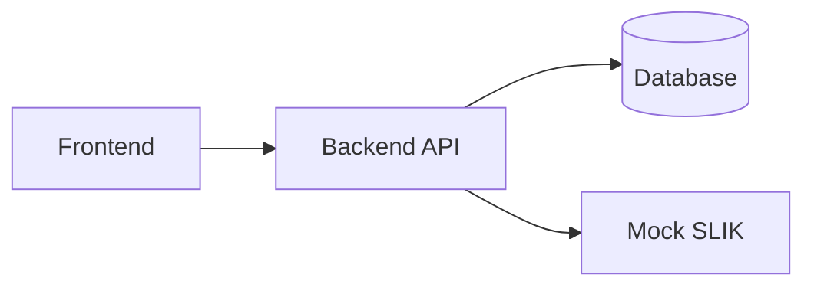

# iMitra — Sistem Originasi Pembiayaan Mikro Syariah

> **Berkas ini adalah TEMPLATE.** Setiap blok `<!-- ISI: ... -->` adalah placeholder yang wajib
> Anda ganti. Jangan biarkan satu pun `<!-- ISI: ... -->` tersisa di tag `v1.0.0` — penilai
> membaca README ini lebih dulu, sebelum menjalankan aplikasi Anda.
>
> Aturan praktis: kalau penilai tidak bisa menjalankan aplikasi Anda hanya dengan membaca
> berkas ini, aplikasi Anda dianggap tidak jalan.

---

## 1. Tim

<!-- ISI: nama tim. Bebas, tapi dipakai konsisten di semua dokumen dan di nama repo. -->

**Nama tim**: iMitra Tim 1

<!-- ISI: tabel di bawah. Satu baris per anggota. Peran diambil dari §10 brief:
     Tech Lead / Integrator, AI Workflow Officer, Backend Engineer, Frontend Engineer,
     QA / Verification, DevOps / Release. Semua peran ikut menulis kode.
     Kolom "Fokus FR" diisi ID FR yang menjadi tanggung jawab utamanya (mis. FR-05, FR-06).
     Isi tabel ini dalam 30 menit pertama dan beri tahu instruktur. -->

| Nama | Peran | Fokus FR | Akun GitHub |
|---|---|---|---|
| Luthfi | Tech Lead / Integrator | FR-08, FR-09 | `<!-- ISI: URL akun -->` |
| Irgiyansyah | Backend Engineer — domain & skoring + DevOps / Release | FR-06, FR-07, FR-13, CI & compose | https://github.com/irgiys/ |
| Yulio Zaki | Backend Engineer — auth & integrasi SLIK | FR-01, FR-05, mock SLIK | https://github.com/yuliozakik |
| Rayvaldo | Backend Engineer — pengajuan & dokumen | FR-02, FR-03, FR-04 | `<!-- ISI: URL akun -->` |
| Aldi | AI Workflow Officer + Frontend Engineer | FR-03/FR-04/FR-08 (UI), FR-11 | https://github.com/aldiariq/ |
| Soleh | QA / Verification | FR-12, test AC-01…AC-15 | `<!-- ISI: URL akun -->` |

**Pembagian tanggung jawab non-koding** (satu berkas = satu pemilik tunggal; orang lain
mengusulkan lewat PR, supaya tidak ada konflik merge pada tabel markdown):

| Pemilik | Berkas yang dimiliki | Lapisan kode yang dimiliki |
|---|---|---|
| Luthfi (Tech Lead) | `AGENTS.md`, `docs/adr/`, memutus saat tim berdebat > 5 menit, merge PR | `internal/service/approval_service.go`, `audit_service.go` |
| Irgiyansyah | `docs/SDD-iMitra.md` (BAB 4 model data, BAB 5 endpoint), `docker-compose.yml`, `.github/workflows/ci.yml`, `.env.example` | `internal/service/skoring_service.go`, `margin_service.go`, tabel parameter, `backend/migrations/` |
| Yulio Zaki | `docs/SRS-iMitra.md` | `internal/httpapi/` middleware auth+peran, `internal/slik/`, `mock-slik/` |
| Rayvaldo | Kontrak API di SDD BAB 5 bersama Irgiyansyah | `internal/service/pengajuan_service.go`, `internal/repository/` |
| Aldi | `docs/AI-WORKFLOW.md`, `docs/AI-DEVLOG.md` (kontributor: semua anggota) | `frontend/app/`, `frontend/components/`, `frontend/lib/` |
| Soleh | `README.md`, `docs/DEMO-SCRIPT.md`, `docs/TRACEABILITY.md` | `*_test.go`, `backend/test/` |

Tim berisi 6 orang, jadi mengikuti bentuk **Tim 2** pada brief §10: peran DevOps / Release
dirangkap oleh salah satu Backend Engineer (Irgiyansyah), bukan oleh QA. Alasannya: DevOps
memiliki `docker-compose.yml`, `ci.yml`, dan migrasi — ketiganya paling sering rusak justru
karena perubahan di backend, jadi lebih murah dipegang orang yang menulis backend. QA
(Soleh) dibiarkan **murni sebagai penjaga gerbang**: kalau QA juga yang menulis CI, ia
menjadi pemeriksa atas pekerjaannya sendiri — pola yang persis kita larang di BR-09.
Semua peran, termasuk Tech Lead dan AI Workflow Officer, tetap ikut menulis kode.

**Pembagian frontend (`frontend/app/`, Next.js 14 App Router)**

Bentuk Tim 2 pada brief §10 hanya menyediakan satu Frontend Engineer, sedangkan UI iMitra
mencakup 6 peran. Kalau seluruh UI ditumpuk ke satu orang, ia menjadi penghambat semua FR
pada jam-jam terakhir. Karena itu pembagiannya **vertikal**: pemilik aturan bisnis sebuah FR
juga menulis UI untuk FR itu, memakai komponen bersama yang disiapkan Aldi. Aldi tetap
pemilik `frontend/` — ia yang menyiapkan fondasi lebih dulu dan me-review PR frontend orang
lain supaya gaya dan pemakaian komponen tetap konsisten.

| Route / bagian UI | Peran pemakai | Penulis | FR | Kapan |
|---|---|---|---|---|
| Fondasi: `app/layout.tsx`, `lib/apiClient.ts`, `lib/auth.ts`, guard peran sisi klien, komponen bersama (`Table`, `StatusBadge`, `FormField`, `ErrorAlert`) | semua | **Aldi** | — | **Kamis paling awal** — semua route lain menunggu ini |
| `app/login` + penyimpanan sesi/token | semua | **Aldi** | FR-01 | Kamis (walking skeleton) |
| `app/(ao)/pengajuan/baru` — form pengajuan | AO | **Rayvaldo** | FR-02 | Kamis (walking skeleton) |
| `app/(ao)/pengajuan` — daftar pengajuan milik AO | AO | **Rayvaldo** | FR-02 | Kamis (walking skeleton) |
| `app/(ao)/pengajuan/[id]/dokumen` — upload & re-upload satu dokumen | AO | **Rayvaldo** | FR-03 | Kamis–Jumat |
| `app/(ao)/pengajuan/[id]/survei` — form survei (koordinat, foto, omzet) | AO | **Aldi** | FR-04 | Kamis–Jumat |
| `app/(anl)/pengajuan/[id]/verifikasi` — verifikasi dokumen + kode alasan tolak | ANL | **Rayvaldo** | FR-03 | Jumat pagi |
| `app/(anl)/pengajuan/[id]/slik` — tombol SLIK check + tampilan hasil & jalur error | ANL | **Yulio Zaki** | FR-05 | Jumat pagi |
| `app/(anl)/pengajuan/[id]/skoring` — **rincian kontribusi tiap komponen** + form override | ANL | **Irgiyansyah** | FR-06 | Jumat pagi |
| `app/(anl)/pengajuan/[id]/margin` — hitung margin/nisbah + tampilan blokir BR-06 | ANL | **Irgiyansyah** | FR-07 | Jumat pagi |
| `app/(approval)/pengajuan/[id]` — kartu keputusan APPROVE / REJECT / RETURN + alasan | KCP, KC, KOM | **Luthfi** | FR-08 | Jumat pagi |
| `app/(anl)/pengajuan/[id]/audit` — tampilan audit trail (read-only) | ANL, approver | **Luthfi** | FR-09 | Jumat pagi |
| `app/dashboard` — pipeline per status, jumlah per tahap, filter per peran | semua | **Soleh** | FR-12 | Jumat, setelah P0 |
| `app/(adm)/parameter` — CRUD bobot skor, ambang approval, rentang margin | ADM | **Irgiyansyah** | FR-13 | Jumat, setelah P0 |
| Notifikasi in-app | semua | **Aldi** | FR-11 | Jumat, setelah P0 |

**Hak akses & review di GitHub**

| Nama | Akses repo | Peran di alur PR |
|---|---|---|
| Luthfi | Write | Tech Lead — approver & **satu-satunya yang me-merge** ke `main` |
| Irgiyansyah | Write | **Approver** (review + approve PR anggota lain), DevOps / Release — pemilik CI, compose, migrasi, dan yang men-tag `v1.0.0` |
| Yulio Zaki | Write | Reviewer bidang auth/SLIK, pemilik `docs/SRS-iMitra.md` |
| Rayvaldo | Write | Reviewer bidang pengajuan/dokumen |
| Aldi | Write | Reviewer seluruh PR `frontend/` |
| Soleh | Write | QA — **gerbang terakhir sebelum merge** (test & lint benar-benar lolos), tidak memiliki CI supaya tidak memeriksa pekerjaannya sendiri |
| Muhammad Harum Alrasyid (instruktur) | Write | Penilai; membuka issue saat cross-review Jumat 16.05 |

Batas yang berlaku untuk approver, mengikuti brief §8.2 dan `AGENTS.md` bagian 4.2:

- **Tidak ada yang menyetujui PR-nya sendiri**, termasuk Tech Lead dan approver. Ini cermin
  git dari BR-09 (maker ≠ checker) — kalau kontrol itu kita tegakkan di aplikasi, kita juga
  menegakkannya pada diri sendiri.
- Setiap PR butuh **minimal 1 approval dari anggota lain**, dan approval hangus kalau ada
  commit baru (`Dismiss stale approvals` aktif di branch protection).
- Approver **tidak boleh** meloloskan PR dengan CI merah atau test yang dilemahkan
  (`AGENTS.md` Larangan 7). Kalau test gagal, yang salah kode atau requirement-nya.
- Dua approver (Luthfi & Irgiyansyah) supaya PR tidak menganggur saat satu orang sedang
  fokus koding — bukan supaya review bisa dilewati.
- Kepemilikan per path didaftarkan di [`.github/CODEOWNERS`](.github/CODEOWNERS) sehingga
  GitHub otomatis meminta review dari orang yang paham konsekuensinya.

Aturan yang berlaku untuk seluruh frontend:

- **Tidak ada aturan bisnis di frontend.** Skoring, margin, routing approval, dan seluruh
  guard BR dihitung di `backend/internal/service/` (`AGENTS.md` bagian 3 dan Larangan 17).
  UI hanya menampilkan hasil dan pesan error dari API.
- **Menyembunyikan tombol bukan otorisasi.** Guard peran di UI sekadar kenyamanan; penolakan
  yang dinilai (AC-02) adalah 403 dari server (`AGENTS.md` Larangan 6).
- **Nomor referensi tidak dibangkitkan di frontend** (`AGENTS.md` Larangan 4).
- **NIK dan path foto tidak boleh masuk URL** — pakai id internal pengajuan (BR-11).
- Pesan error diambil dari field `message` respons API, jangan disusun ulang di UI, supaya
  pesan yang menyebut kode BR (AC-04) tidak hilang.
- Semua panggilan API lewat `lib/apiClient.ts`; jangan ada `fetch()` telanjang di komponen.

<!-- ISI: kalau peran berubah di hari kedua, catat perubahannya di sini beserta alasan
     dan jam perubahannya. Perubahan peran tidak dilarang; perubahan yang tidak dicatat
     yang jadi masalah. -->

**Perubahan peran selama hackathon**:

| Jam | Perubahan | Alasan |
|---|---|---|
| 2026-08-20 11:10 | Peran **DevOps / Release** pindah dari Soleh (QA) ke **Irgiyansyah**, beserta kepemilikan `ci.yml`, `docker-compose.yml`, `.env.example`, dan `backend/migrations/` | QA dibiarkan murni sebagai penjaga gerbang. Kalau QA juga yang menulis CI, ia menjadi pemeriksa atas pekerjaannya sendiri — pola yang persis kita larang di BR-09 (maker ≠ checker). Dicatat di `AGENTS.md` riwayat baris 11:10 |
| 2026-08-20 17:10 | Tabel di atas dan `docs/AI-WORKFLOW.md` disesuaikan agar mencerminkan perubahan 11:10 | Ketiga dokumen sebelumnya tidak sinkron: `AGENTS.md` sudah memindahkan DevOps ke Irgiyansyah sejak 11:10, tetapi README dan AI-WORKFLOW masih mencantumkan "CI & compose" sebagai tugas Soleh. Ditemukan saat audit QA atas tugas yang belum dikerjakan |

---

## 2. Cara Menjalankan

<!-- ISI: Target wajib (§7.2 butir 1): penilai melakukan git clone di mesin bersih,
     menjalankan SATU perintah, dan aplikasi hidup. Uji ini sendiri dari direktori
     kosong minimal sekali sebelum Gate 2 dan sekali lagi sebelum code freeze.
     Jangan tulis langkah yang belum pernah Anda jalankan dari clone bersih. -->

### 2.1 Prasyarat

<!-- ISI: daftar prasyarat beserta versi minimum. Contoh format:
     - Docker Engine >= 24 dan Docker Compose v2
     - (kalau tanpa Docker) runtime bahasa X versi Y -->

- `<!-- ISI: prasyarat 1 -->`
- `<!-- ISI: prasyarat 2 -->`

### 2.2 Langkah

```bash
git clone <!-- ISI: URL repo -->
cd <!-- ISI: nama direktori -->
cp .env.example .env
<!-- ISI: satu perintah untuk menjalankan, mis. docker compose up --build -->
```

### 2.3 Alamat layanan setelah jalan

<!-- ISI: sesuaikan port dengan .env.example Anda. -->

| Layanan | URL | Catatan |
|---|---|---|
| Frontend | `<!-- ISI -->` |  |
| Backend API | `<!-- ISI -->` |  |
| Mock SLIK | `<!-- ISI -->` |  |
| Database | `<!-- ISI -->` |  |

### 2.4 Migrasi & seed

<!-- ISI: perintah migrasi dan seed. Wajib idempoten — bisa dijalankan berulang tanpa error
     (§7.2 butir 4 dan 5). Sebutkan juga cara MERESET demo ke kondisi awal, karena penilai
     mungkin meminta demo diulang. -->

```bash
<!-- ISI: perintah migrasi -->
<!-- ISI: perintah seed -->
<!-- ISI: perintah reset -->
```

### 2.5 Akun demo

<!-- ISI: daftar akun hasil seed, satu baris per peran. Password boleh ditulis di sini
     karena ini akun seed non-produksi — tetapi JANGAN pernah menaruh secret nyata
     (JWT secret, kredensial DB produksi, token API) di berkas ini atau di mana pun
     dalam repo. Secret ter-commit = pengurangan -10. -->

| Peran | Username | Password | Dipakai untuk AC |
|---|---|---|---|
| AO | `<!-- ISI -->` | `<!-- ISI -->` |  |
| ANL | `<!-- ISI -->` | `<!-- ISI -->` |  |
| KCP | `<!-- ISI -->` | `<!-- ISI -->` |  |
| KC | `<!-- ISI -->` | `<!-- ISI -->` |  |
| KOM | `<!-- ISI -->` | `<!-- ISI -->` |  |
| ADM | `<!-- ISI -->` | `<!-- ISI -->` |  |

### 2.6 Test & lint

<!-- ISI: perintah persis. Harus sama dengan yang dipakai di .github/workflows/ci.yml
     dan yang tertulis di AGENTS.md. Kalau ketiganya berbeda, salah satunya sudah usang. -->

```bash
<!-- ISI: perintah test -->
<!-- ISI: perintah lint -->
```

---

## 3. Arsitektur Singkat

<!-- ISI: 5-10 baris prosa, bukan lebih. Jelaskan: komponen apa saja, siapa memanggil siapa,
     di mana aturan bisnis ditegakkan, dan bagaimana otorisasi bekerja di server.
     Detail lengkapnya ada di docs/SDD-iMitra.md — jangan duplikasi, cukup rujuk. -->

`<!-- ISI: deskripsi arsitektur -->`

<!-- ISI: diagram arsitektur. Mermaid inline diterima dan disarankan karena ikut ter-render
     di GitHub. Diagram harus benar-benar ADA — tulisan "diagram terlampir" dinilai sebagai
     tidak ada. Hapus contoh di bawah dan gambar arsitektur Anda sendiri. -->



**Stack yang dipilih**: `<!-- ISI: bahasa, framework, database, ORM -->`
Alasan pemilihan ada di [`docs/adr/0001-pilihan-stack.md`](docs/adr/0001-pilihan-stack.md).

**Aturan untuk AI agent**: [`AGENTS.md`](AGENTS.md)

---

## 4. Status Functional Requirements

<!-- ISI: kolom Status dan PR. Kolom FR / Requirement / Prioritas sudah benar sesuai brief §3
     — jangan diubah, penilai mencocokkannya.
     Nilai Status yang diizinkan, pilih satu:
       - Selesai & teruji  : lolos AC terkait, ada test otomatis, sudah di-merge ke main
       - Selesai           : jalan dan di-merge, tetapi belum ada test otomatis
       - Sebagian          : hanya sebagian AC terpenuhi. WAJIB dijelaskan di bagian 5
       - Tidak dikerjakan  : sengaja dibuang. WAJIB dijelaskan di bagian 5
     Jangan pakai "In progress" di tag v1.0.0 — pada saat itu tidak ada lagi yang sedang jalan.
     Kolom PR: nomor PR yang menyelesaikannya, mis. #14, #21.
     Perbarui tabel ini setiap kali PR di-merge, bukan sekali di akhir. -->

### P0 — WAJIB (batas lulus fungsional)

| FR | Requirement | Prioritas | Status | PR |
|---|---|---|---|---|
| FR-01 | Autentikasi & Otorisasi Berbasis Peran | P0 |  |  |
| FR-02 | Pengajuan Pembiayaan Mikro | P0 |  |  |
| FR-03 | Upload & Verifikasi Dokumen | P0 |  |  |
| FR-04 | Survei Lapangan (OTS) | P0 |  |  |
| FR-05 | SLIK Check | P0 |  |  |
| FR-06 | Skoring Kelayakan Mikro | P0 |  |  |
| FR-07 | Perhitungan Margin / Nisbah | P0 |  |  |
| FR-08 | Approval Berjenjang | P0 | Selesai & teruji | #6 |
| FR-09 | Audit Trail | P0 | Selesai & teruji | #6 |

### P1 — SEHARUSNYA (nilai penuh butuh ini)

| FR | Requirement | Prioritas | Status | PR |
|---|---|---|---|---|
| FR-10 | Pembiayaan Kelompok (Majelis) | P1 |  |  |
| FR-11 | Notifikasi Perubahan Status | P1 |  |  |
| FR-12 | Dashboard Pipeline | P1 |  |  |
| FR-13 | Parameter Terkonfigurasi | P1 |  |  |

### P2 — BOLEH (hanya kalau P0 dan P1 tuntas dan teruji)

| FR | Requirement | Prioritas | Status | PR |
|---|---|---|---|---|
| FR-14 | Simulasi angsuran murabahah & proyeksi bagi hasil musyarakah | P2 |  |  |
| FR-15 | Ekspor daftar pengajuan ke CSV | P2 |  |  |
| FR-16 | Mode draft offline untuk AO di lapangan | P2 |  |  |
| FR-17 | Deteksi lokasi palsu (mock location) pada survei lapangan | P2 |  |  |
| FR-18 | Laporan Turn-Around Time per tahap dan per petugas | P2 |  |  |

Penelusuran rinci FR → endpoint → test → PR ada di [`docs/TRACEABILITY.md`](docs/TRACEABILITY.md).

---

## 5. Tidak Diimplementasikan dan Mengapa

> **Bagian ini wajib ada dan wajib terisi.** Ia bukan pengakuan kegagalan — ia bukti bahwa
> tim memutuskan secara sadar.
>
> Kenapa penting: menurut brief §11 (Gate 3) dan §12, **fitur setengah jadi yang dibiarkan
> mengambang tanpa catatan bernilai negatif (−5 per fitur, maksimum −10), sementara fitur
> yang dibuang dengan alasan tertulis bernilai positif.** Membuang FR-14 dengan alasan
> "P0 belum semua teruji, kami pilih memperkuat FR-06" adalah keputusan rekayasa dan
> dinilai sebagai keahlian. Meninggalkan tombol yang tidak berfungsi tanpa penjelasan
> adalah utang yang tidak diakui.
>
> Tulis bagian ini pada Gate 3 (Jumat 11.20), bukan pada Jumat 14.55.

<!-- ISI: satu baris per FR atau bagian FR yang tidak selesai. Isi kolom Keputusan dengan
     "Dibuang" (sengaja tidak dikerjakan) atau "Sebagian" (ada yang jalan, ada yang tidak).
     Untuk "Sebagian", sebutkan dengan tepat apa yang jalan dan apa yang tidak, supaya
     penilai tidak menemukannya sendiri saat demo.
     Alasan harus alasan rekayasa (prioritas, risiko, waktu, dependensi), bukan "kehabisan waktu"
     tanpa keterangan. -->

| FR / Bagian | Keputusan | Apa yang jalan | Apa yang tidak | Alasan | Diputuskan kapan |
|---|---|---|---|---|---|
|  |  |  |  |  |  |
|  |  |  |  |  |  |
|  |  |  |  |  |  |

**Utang teknis yang kami sadari**:

<!-- ISI: hal-hal yang jalan tapi Anda tahu belum benar. Contoh: validasi hanya di frontend
     pada satu form tertentu, indeks database belum ada, penanganan timeout SLIK masih kasar.
     Menyebutkannya lebih dulu lebih baik daripada ditemukan penilai. -->

- `<!-- ISI -->`

---

## 6. Catatan AI Workflow

Tim ini memakai AI sebagai alat rekayasa. Jejaknya ada di tiga tempat:

| Dokumen | Isi |
|---|---|
| [`AGENTS.md`](AGENTS.md) | Aturan repo yang dibaca AI agent: stack, struktur, konvensi, aturan bisnis, larangan |
| [`docs/AI-WORKFLOW.md`](docs/AI-WORKFLOW.md) | Tool dan model apa untuk tugas apa, cara memberi konteks, pembagian AI vs manual |
| [`docs/AI-DEVLOG.md`](docs/AI-DEVLOG.md) | Jurnal pemakaian AI: minimal 10 entri, minimal 3 di antaranya kasus AI salah dan kami menangkapnya |

<!-- ISI: 3-5 baris ringkasan. Bukan menyalin isi ketiga dokumen di atas, tetapi menjawab:
     apa satu pola pemakaian AI yang terbukti paling berguna bagi tim ini selama 2 hari,
     dan apa satu hal yang Anda putuskan untuk TIDAK diserahkan ke AI. Penilai kemungkinan
     besar akan menanyakan ini di sesi tanya jawab, jadi jawaban tertulisnya sebaiknya
     sudah Anda sepakati bersama. -->

`<!-- ISI: ringkasan -->`

**Keputusan arsitektur yang menolak saran AI**: `<!-- ISI: rujuk nomor ADR, mis. docs/adr/0003-....md -->`

---

## 7. Dokumen Lain

| Dokumen | Isi |
|---|---|
| [`docs/SRS-iMitra.md`](docs/SRS-iMitra.md) | Requirement ringkas turunan brief |
| [`docs/SDD-iMitra.md`](docs/SDD-iMitra.md) | Arsitektur, model data, daftar endpoint |
| [`docs/TRACEABILITY.md`](docs/TRACEABILITY.md) | FR → AC → endpoint → test → PR |
| [`docs/DEMO-SCRIPT.md`](docs/DEMO-SCRIPT.md) | Skrip demo AC-01 s.d. AC-15 beserta data uji |
| [`docs/adr/`](docs/adr/) | Architecture Decision Records (minimal 3) |
| [`fixtures/nasabah-uji.csv`](fixtures/nasabah-uji.csv) | Data uji wajib untuk mock SLIK |
| [`SETUP-SPRINT-0.md`](SETUP-SPRINT-0.md) | Checklist Sprint 0 — kerjakan ini lebih dulu |