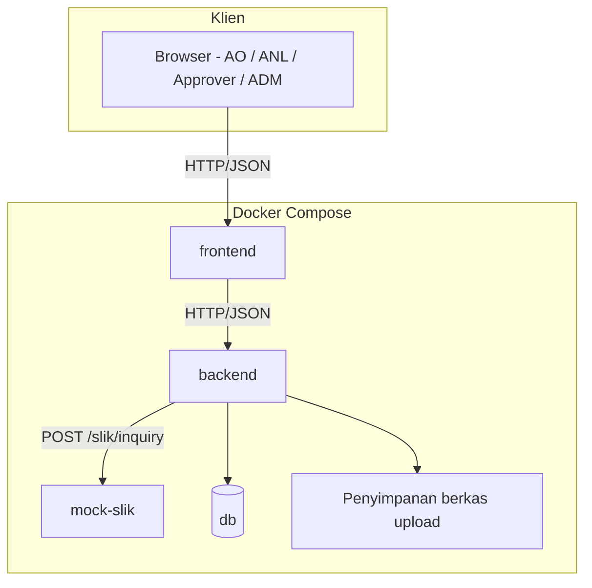
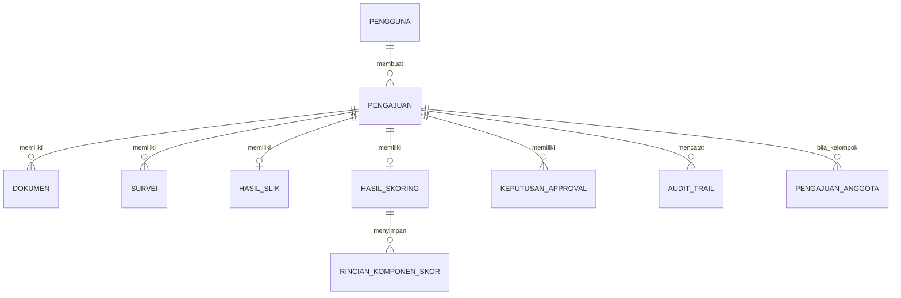
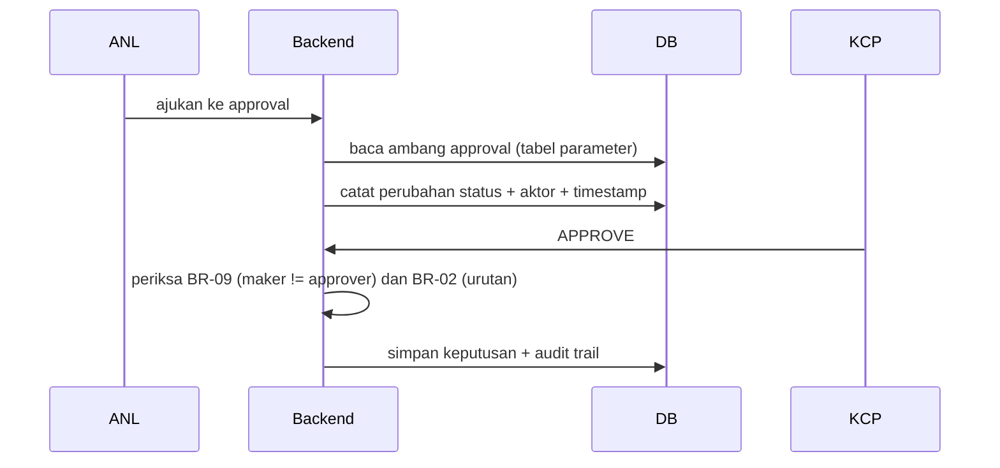
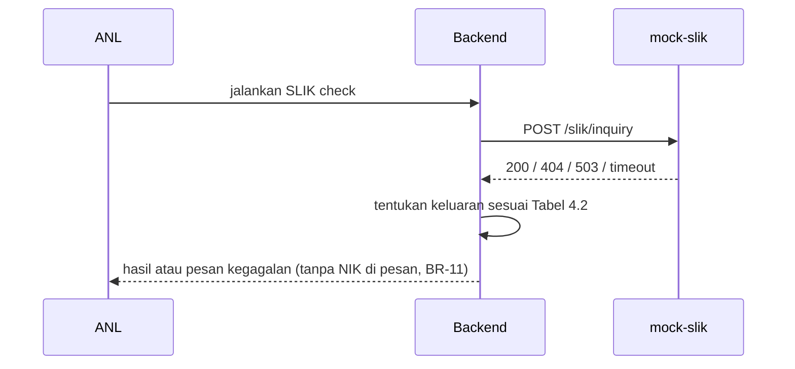

# SDD — iMitra (Software Design Document)

> ## Baca ini dulu
>
> **1. Ini versi RINGKAS turunan brief hackathon.** Target maksimal **3 halaman**. Jangan
> habiskan waktu di sini. Yang paling bernilai dari dokumen ini bagi tim Anda sendiri adalah
> BAB 4 (model data) dan BAB 5 (daftar endpoint) — keduanya dipakai setiap kali Anda memberi
> konteks ke AI. Sisanya cukup ringkas.
>
> **2. Kerjakan BAB 2 dan BAB 4 di Sprint 0, sebelum menulis kode.** Brief §13 butir 1:
> satu jam di model data menghemat empat jam refactor. BAB lain dilengkapi sambil berjalan.
>
> **3. DIAGRAM HARUS BENAR-BENAR ADA.** Ini kelemahan yang muncul di hampir semua tugas
> SRS/SDD di kelas ini: BAB "UML Design" yang isinya hanya tulisan "lampirkan diagram di
> sini" atau "diagram menyusul". Placeholder seperti itu **dinilai sebagai diagram yang
> tidak ada**, dan BAB 3 adalah BAB yang paling sering ditanya di Gate 1. Mermaid inline
> diterima dan disarankan — ia ter-render di GitHub dan bisa direview di PR. Kalau memakai
> gambar, berkas gambarnya wajib ter-commit di repo, bukan tautan ke Google Drive.
>
> **4. Dokumen ini harus cocok dengan kode.** Penilai membandingkan keduanya (aspek
> "Kualitas kode & arsitektur"). Kalau kode berubah arah, perbarui SDD-nya — atau catat di
> ADR bahwa desain awal ditinggalkan dan mengapa.
>
> Ganti setiap `<!-- ISI: ... -->`. Di dalam blok Mermaid jangan pakai `<!-- ISI -->`,
> karena akan merusak render — ganti langsung nama node-nya. Hapus blok catatan ini
> sebelum tag `v1.0.0`.

**Dokumen**: Software Design Document
**Sistem**: iMitra
**Tim**: `<!-- ISI: nama tim -->`
**Versi**: `<!-- ISI -->`
**Tanggal**: `<!-- ISI -->`
**Penyusun**: `<!-- ISI -->`

---

## BAB 1 — DESIGN OVERVIEW

### 1.1 Tujuan Dokumen

<!-- ISI: 2-3 baris. Dokumen ini menjelaskan bagaimana requirement di SRS diwujudkan. -->

`<!-- ISI -->`

### 1.2 Prinsip Desain yang Kami Pegang

<!-- ISI: 3-5 prinsip, masing-masing satu baris, dan masing-masing punya konsekuensi nyata
     di kode. Prinsip yang tidak mengubah apa pun tidak perlu ditulis.
     Contoh bentuk yang berguna:
     - Aturan bisnis hanya hidup di lapisan service; controller tidak memutuskan apa pun.
     - Parameter bisnis dibaca dari database di setiap pemakaian, tidak di-cache di proses
       (supaya AC-15 terpenuhi tanpa restart).
     - Otorisasi diperiksa di server pada setiap request, tidak diwakilkan ke frontend. -->

- `<!-- ISI -->`

### 1.3 Ringkasan Keputusan Teknologi

<!-- ISI: tabel ringkas. Alasan lengkapnya di docs/adr/0001-pilihan-stack.md — cukup rujuk. -->

| Lapisan | Teknologi | Versi |
|---|---|---|
| Backend | `<!-- ISI -->` | `<!-- ISI -->` |
| Frontend | `<!-- ISI -->` | `<!-- ISI -->` |
| Database | `<!-- ISI -->` | `<!-- ISI -->` |
| Mock SLIK | `<!-- ISI -->` | `<!-- ISI -->` |

---

## BAB 2 — HIGH-LEVEL ARCHITECTURE

### 2.1 Diagram Komponen

<!-- ISI: WAJIB ADA GAMBAR. Yang harus terlihat: frontend, backend, mock SLIK sebagai
     layanan terpisah yang dipanggil via HTTP (brief §7.2 butir 3), database, dan
     penyimpanan berkas upload. Ganti nama node dengan nama layanan nyata Anda. -->

### 2.2 Lapisan di Dalam Backend

<!-- ISI: sebutkan lapisan dan aturan ketergantungannya (siapa boleh memanggil siapa).
     Ini bagian yang paling banyak menghemat waktu ketika memberi konteks ke AI, karena
     ia menentukan di mana kode baru diletakkan. Harus konsisten dengan AGENTS.md bagian 3. -->

| Lapisan | Tanggung jawab | Boleh memanggil | Tidak boleh |
|---|---|---|---|
| `<!-- ISI -->` | `<!-- ISI -->` | `<!-- ISI -->` | `<!-- ISI -->` |
| `<!-- ISI -->` | `<!-- ISI -->` | `<!-- ISI -->` | `<!-- ISI -->` |
| `<!-- ISI -->` | `<!-- ISI -->` | `<!-- ISI -->` | `<!-- ISI -->` |

### 2.3 Di Mana Setiap Aturan Bisnis Ditegakkan

<!-- ISI: pemetaan singkat BR -> modul. Cukup rujuk AGENTS.md bagian 5 dan
     docs/TRACEABILITY.md supaya tidak ada tiga versi yang berbeda. Yang perlu ditulis di
     sini hanyalah keputusan desainnya: mis. "seluruh BR yang berkaitan dengan transisi
     status ditegakkan di satu modul state machine, bukan tersebar di controller". -->

`<!-- ISI -->`

### 2.4 Penanganan Kegagalan Integrasi SLIK

<!-- ISI: rancangan konkret. Sebutkan: nilai timeout dan dari mana dibaca, apakah ada retry
     (dan kalau ada, berapa kali serta mengapa aman), bagaimana kegagalan direpresentasikan
     di database, dan bagaimana AO/ANL mengetahuinya. Ingat: sistem tidak boleh diam-diam
     melanjutkan seolah SLIK bersih. -->

`<!-- ISI -->`

---

## BAB 3 — UML DESIGN

> WAJIB ADA GAMBAR di ketiga sub-bab. Kalau waktu terbatas, prioritaskan 3.1 (class/ERD)
> dan 3.2 (sequence approval berjenjang) — keduanya yang paling sering ditanya di gate.

### 3.1 Class Diagram / Entity Relationship

<!-- ISI: WAJIB ADA GAMBAR. Yang harus terjawab dari diagram ini: bagaimana satu pengajuan
     bisa mewakili nasabah perorangan MAUPUN kelompok 3-10 anggota (brief §1.3 butir 2,
     dan AC-14 yang menuntut total plafon dihitung ulang setelah satu anggota ditolak).
     Ganti seluruh nama entitas dan atribut di bawah dengan milik Anda; contoh ini hanya
     menunjukkan bentuk yang diharapkan. -->

### 3.2 Sequence Diagram — Approval Berjenjang

<!-- ISI: WAJIB ADA GAMBAR. Yang harus terlihat: penentuan level dari total plafon
     (Tabel 4.1), urutan wajib KCP -> KC -> KOM (BR-02), penolakan maker=approver di server
     (BR-09), dan penulisan audit trail di setiap keputusan (BR-10). -->

### 3.3 Sequence Diagram — SLIK Check dan Jalur Error

<!-- ISI: WAJIB ADA GAMBAR. Tunjukkan ketiga cabang: 200 (kol 1 / 2 / 3-5), 404, 503 &
     timeout. Diagram ini yang membuktikan Anda memikirkan jalur error sebelum jam ke-9. -->

### 3.4 Diagram Lain (opsional)

<!-- ISI: activity diagram untuk skoring, atau component diagram frontend. Tambahkan hanya
     kalau benar-benar membantu tim, bukan untuk menambah halaman. -->

---

## BAB 4 — DATABASE DESIGN

### 4.1 Daftar Tabel

<!-- ISI: satu baris per field. Tabel di bawah sudah memuat kerangka nama tabel yang
     kemungkinan Anda perlukan — ubah, gabung, atau hapus sesuai model data Anda sendiri;
     ini bukan skema resmi.
     Yang wajib ada apa pun rancangan Anda:
     - nomor referensi unik format IMT-YYYYMMDD-NNNN (BR-12)
     - plafon per anggota untuk kelompok, supaya total bisa dihitung ulang (AC-14)
     - rincian komponen skor yang tersimpan, bukan hanya skor akhir (BR-08)
     - audit trail append-only dengan aktor + timestamp (BR-10, AC-13)
     - tabel parameter untuk bobot skor, ambang approval, dan rentang margin (FR-13, AC-15)
     Untuk kolom yang menyimpan NIK, catat di kolom Description bagaimana BR-11 ditegakkan. -->

| Table | Field | Type | Description |
|---|---|---|---|
| `<!-- ISI: pengguna -->` |  |  |  |
|  |  |  |  |
| `<!-- ISI: pengajuan -->` |  |  |  |
|  |  |  |  |
| `<!-- ISI: pengajuan_anggota -->` |  |  |  |
|  |  |  |  |
| `<!-- ISI: dokumen -->` |  |  |  |
|  |  |  |  |
| `<!-- ISI: survei -->` |  |  |  |
|  |  |  |  |
| `<!-- ISI: hasil_slik -->` |  |  |  |
|  |  |  |  |
| `<!-- ISI: hasil_skoring -->` |  |  |  |
|  |  |  |  |
| `<!-- ISI: rincian_komponen_skor -->` |  |  |  |
|  |  |  |  |
| `<!-- ISI: keputusan_approval -->` |  |  |  |
|  |  |  |  |
| `<!-- ISI: audit_trail -->` |  |  |  |
|  |  |  |  |
| `<!-- ISI: parameter_skoring -->` |  |  |  |
|  |  |  |  |
| `<!-- ISI: ambang_approval -->` |  |  |  |
|  |  |  |  |
| `<!-- ISI: rentang_margin -->` |  |  |  |
|  |  |  |  |
| `<!-- ISI: notifikasi -->` |  |  |  |
|  |  |  |  |

### 4.2 Strategi Migrasi

<!-- ISI: brief §7.2 butir 4 mewajibkan skema dibangun dari migrasi, bukan dari db.sql yang
     di-restore manual. Tulis: tool migrasi, konvensi nama berkas migrasi, siapa yang boleh
     membuat migrasi baru, dan aturan bahwa migrasi yang sudah di-merge tidak boleh diubah
     (juga tercantum di AGENTS.md bagian 6 butir 2). -->

`<!-- ISI -->`

### 4.3 Seed Data

<!-- ISI: apa yang di-seed (pengguna per peran, parameter awal dari brief §4, data SLIK dari
     fixtures/nasabah-uji.csv, data untuk AC-12 dan AC-14), dan bagaimana seed dibuat
     idempoten sehingga bisa dijalankan berulang tanpa error (§7.2 butir 5). -->

`<!-- ISI -->`

### 4.4 Bagaimana Audit Trail Dijaga Append-Only

<!-- ISI: sebutkan mekanismenya, bukan niatnya. Pilihan yang lazim: tidak ada endpoint
     UPDATE/DELETE untuk tabel itu, hak akses database dibatasi, atau constraint/trigger.
     AC-13 meminta Anda membuktikannya dari daftar route — sebutkan bagaimana Anda
     akan menunjukkannya. -->

`<!-- ISI -->`

---

## BAB 5 — API DESIGN

<!-- ISI: daftar endpoint nyata. Kolom Auth diisi peran yang berhak (AO/ANL/KCP/KC/KOM/ADM)
     — bukan "ya/tidak", karena AC-02 menguji penolakan lintas-peran secara langsung.
     Baris di bawah adalah kerangka saran; ubah path dan tambah/kurangi sesuai desain Anda.
     Tabel ini juga harus tercermin di docs/TRACEABILITY.md kolom Endpoint. -->

| Endpoint | Method | Auth | Description |
|---|---|---|---|
| `<!-- ISI: /api/auth/login -->` | POST | Publik | `<!-- ISI -->` |
| `<!-- ISI -->` | `<!-- ISI -->` | `<!-- ISI -->` | `<!-- ISI -->` |
| `<!-- ISI -->` | `<!-- ISI -->` | `<!-- ISI -->` | `<!-- ISI -->` |
| `<!-- ISI -->` | `<!-- ISI -->` | `<!-- ISI -->` | `<!-- ISI -->` |
| `<!-- ISI -->` | `<!-- ISI -->` | `<!-- ISI -->` | `<!-- ISI -->` |
| `<!-- ISI -->` | `<!-- ISI -->` | `<!-- ISI -->` | `<!-- ISI -->` |
| `<!-- ISI -->` | `<!-- ISI -->` | `<!-- ISI -->` | `<!-- ISI -->` |
| `<!-- ISI -->` | `<!-- ISI -->` | `<!-- ISI -->` | `<!-- ISI -->` |
| `<!-- ISI -->` | `<!-- ISI -->` | `<!-- ISI -->` | `<!-- ISI -->` |
| `<!-- ISI -->` | `<!-- ISI -->` | `<!-- ISI -->` | `<!-- ISI -->` |
| `<!-- ISI -->` | `<!-- ISI -->` | `<!-- ISI -->` | `<!-- ISI -->` |
| `<!-- ISI -->` | `<!-- ISI -->` | `<!-- ISI -->` | `<!-- ISI -->` |

**Endpoint mock SLIK** (kontrak dari brief §6.1, tidak boleh diubah):

| Endpoint | Method | Auth | Description |
|---|---|---|---|
| `/slik/inquiry` | POST | — | Inquiry kolektibilitas berdasarkan NIK. 200 / 404 `NIK_NOT_FOUND` / 503 `SERVICE_UNAVAILABLE` |

### 5.1 Bentuk Respons Error

<!-- ISI: satu bentuk untuk seluruh API, sama dengan AGENTS.md bagian 4.3. Sebutkan juga
     kode HTTP mana untuk situasi mana, khususnya 403 untuk pelanggaran peran (AC-02) dan
     kode untuk pelanggaran aturan bisnis yang pesannya menyebut BR-xx (AC-04). -->

`<!-- ISI -->`

### 5.2 Autentikasi & Otorisasi

<!-- ISI: mekanisme (session atau JWT), di mana peran diperiksa (middleware? per handler?),
     dan bagaimana pemisahan maker/checker (BR-09) diperiksa — karena BR-09 tidak bisa
     diperiksa hanya dari peran, ia memerlukan perbandingan identitas pembuat pengajuan
     dengan identitas penyetuju. Sebutkan di mana pemeriksaan itu berada. -->

`<!-- ISI -->`

---

## BAB 6 — UI/UX DESIGN

### 6.1 Daftar Layar per Peran

<!-- ISI: satu baris per layar. Tidak perlu mockup; yang dinilai adalah kejelasan pembagian
     per peran dan kesesuaiannya dengan otorisasi server. -->

| Layar | Peran | Elemen utama | Catatan otorisasi |
|---|---|---|---|
| `<!-- ISI -->` | `<!-- ISI -->` | `<!-- ISI -->` | `<!-- ISI -->` |

### 6.2 Alur Navigasi

<!-- ISI: diagram sederhana atau daftar berurutan. Kalau memakai diagram, pastikan gambarnya
     benar-benar ada. -->

`<!-- ISI -->`

### 6.3 Keputusan UX Khusus iMitra

<!-- ISI: yang layak ditulis di sini:
     - Bagaimana rincian komponen skor ditampilkan ke ANL (BR-08, AC-07) — ini bukan sekadar
       angka; analis harus bisa mempertanggungjawabkannya ke auditor.
     - Bagaimana AO merekam koordinat dan foto survei di lapangan.
     - Bagaimana form pengajuan kelompok 3-10 anggota ditangani tanpa menjadi form raksasa.
     - Bagaimana pesan pelanggaran aturan bisnis ditampilkan (menyebut BR-xx, tetapi tetap
       bisa dipahami pengguna). -->

`<!-- ISI -->`

### 6.4 Catatan Aksesibilitas & Responsif

<!-- ISI: singkat. AO bekerja di lapangan; mobile-first boleh menjadi pilihan desain
     (brief §1.4 — web responsif cukup, mobile native di luar lingkup). -->

`<!-- ISI -->`

---

## BAB 7 — SECURITY DESIGN

<!-- ISI: isi tabel. Jangan menulis prinsip umum keamanan; tulis apa yang benar-benar ada
     di sistem ini dan bagaimana ia bisa diperiksa. -->

| Aspek | Rancangan | Cara diverifikasi |
|---|---|---|
| Penyimpanan password | `<!-- ISI: algoritma hashing + parameter -->` | `<!-- ISI -->` |
| Sesi / token | `<!-- ISI: masa berlaku, tempat penyimpanan di klien, cara pencabutan -->` | `<!-- ISI -->` |
| Otorisasi per endpoint | `<!-- ISI -->` | AC-02 (panggilan API langsung harus 403) |
| Pemisahan maker/checker (BR-09) | `<!-- ISI -->` | AC-11 |
| Perlindungan data pribadi (BR-11) | `<!-- ISI: bagaimana NIK dijauhkan dari log, pesan error, dan URL; bagaimana akses berkas foto dikendalikan -->` | `<!-- ISI: mis. memeriksa log setelah menjalankan skenario demo -->` |
| Akses berkas upload | `<!-- ISI: apakah URL berkas bisa diakses tanpa otorisasi? -->` | `<!-- ISI -->` |
| Audit trail append-only | `<!-- ISI -->` | AC-13 |
| Manajemen secret | `<!-- ISI: .env.example di repo, .env tidak; dari mana nilai dibaca -->` | `<!-- ISI: pemeriksaan git log -->` |
| Validasi input | `<!-- ISI -->` | `<!-- ISI -->` |

**Yang secara sadar tidak kami tangani di rilis ini** (dan mengapa aman untuk konteks
hackathon): `<!-- ISI: mis. rate limiting, enkripsi at-rest, rotasi kunci. Menyebutkannya
lebih baik daripada dianggap terlewat. -->`

---

## BAB 8 — DEPLOYMENT DESIGN

### 8.1 Topologi Docker Compose

<!-- ISI: daftar service, port, dan ketergantungan antar service. Harus cocok dengan
     docker-compose.yml dan .env.example — kalau berbeda, penilai akan menemukannya saat
     menjalankan docker compose up. -->

| Service | Image / build | Port host:container | Bergantung pada | Healthcheck |
|---|---|---|---|---|
| `backend` | `<!-- ISI -->` | `<!-- ISI -->` | `<!-- ISI -->` | `<!-- ISI -->` |
| `frontend` | `<!-- ISI -->` | `<!-- ISI -->` | `<!-- ISI -->` | `<!-- ISI -->` |
| `mock-slik` | `<!-- ISI -->` | `<!-- ISI -->` | `<!-- ISI -->` | `<!-- ISI -->` |
| `db` | `<!-- ISI -->` | `<!-- ISI -->` | — | `<!-- ISI -->` |

### 8.2 Variabel Lingkungan

<!-- ISI: rujuk .env.example, jangan menyalin nilainya ke sini. Yang perlu ditulis:
     variabel mana yang wajib diubah sebelum menjalankan, dan mana yang boleh dibiarkan
     default untuk demo. -->

`<!-- ISI -->`

### 8.3 Urutan Startup

<!-- ISI: urutan nyata, termasuk kapan migrasi dan seed dijalankan. Sebutkan bagaimana
     backend menunggu database siap — ini penyebab paling umum "jalan di laptop saya,
     gagal di mesin penilai". -->

`<!-- ISI -->`

### 8.4 CI

<!-- ISI: apa yang dijalankan CI (lint, test, build), pada event apa, dan berapa lama.
     Ingat: CI merah di tag v1.0.0 dikenai pengurangan -5. -->

`<!-- ISI -->`

### 8.5 Rilis

<!-- ISI: tag v1.0.0 pada Jumat 15.00. Sebutkan siapa yang membuat tag dan apa yang
     diperiksa sebelum tag dibuat (checklist singkat). -->

`<!-- ISI -->`

---

## Riwayat Revisi

| Versi | Tanggal | Oleh | Perubahan |
|---|---|---|---|
| `<!-- ISI -->` | `<!-- ISI -->` | `<!-- ISI -->` | Versi awal |
