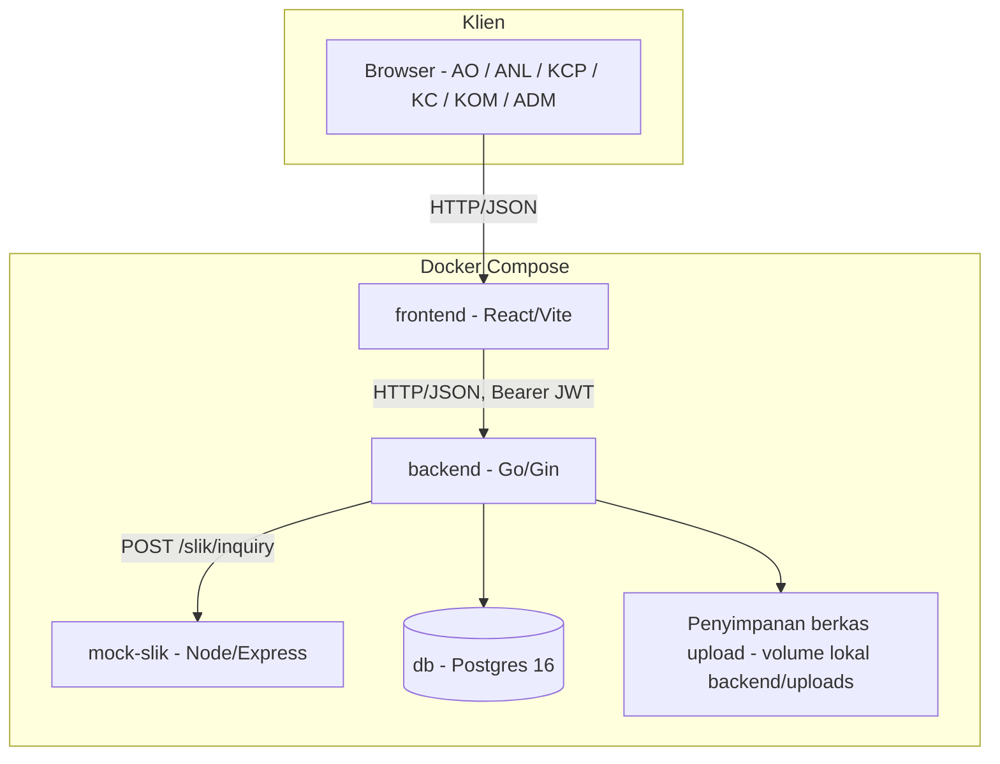
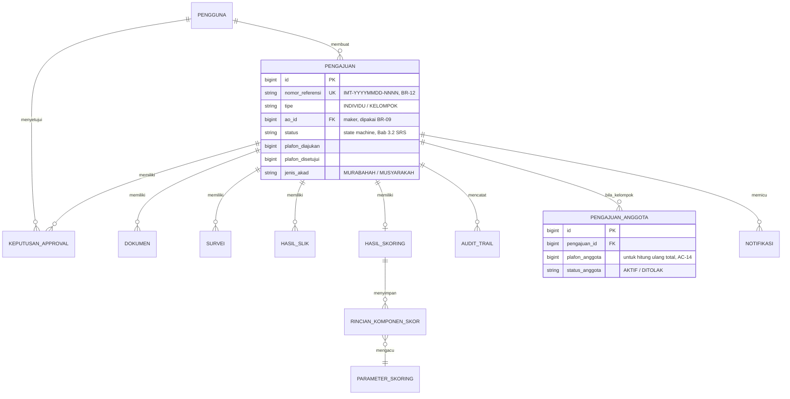
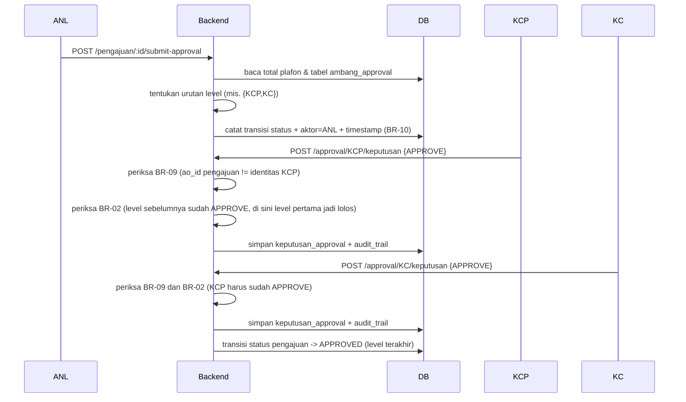
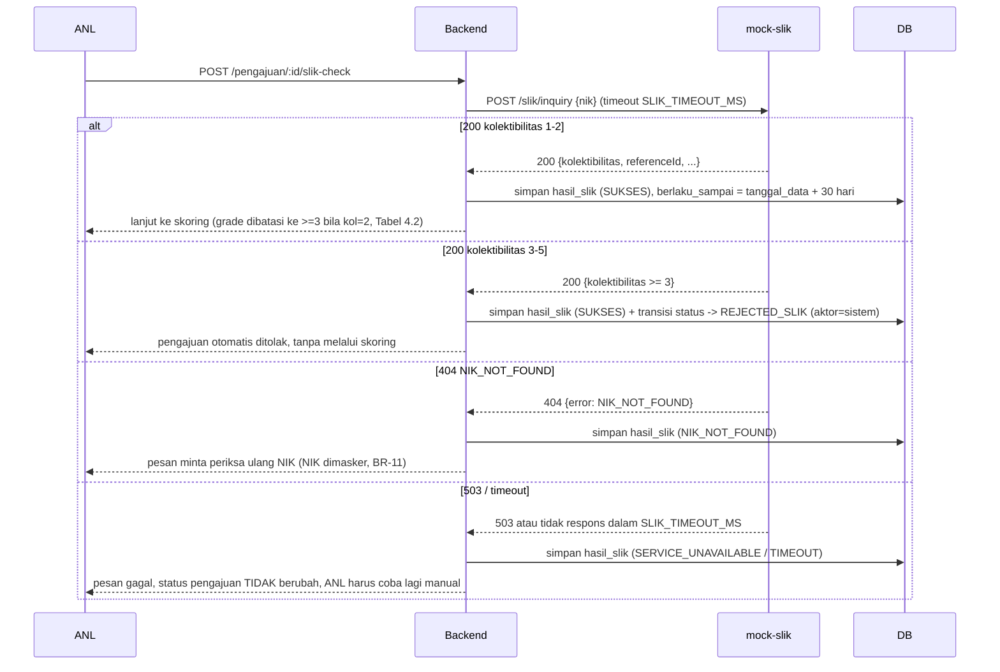
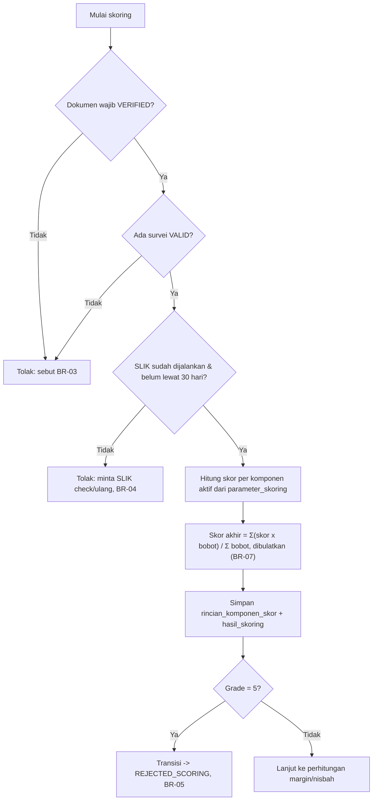
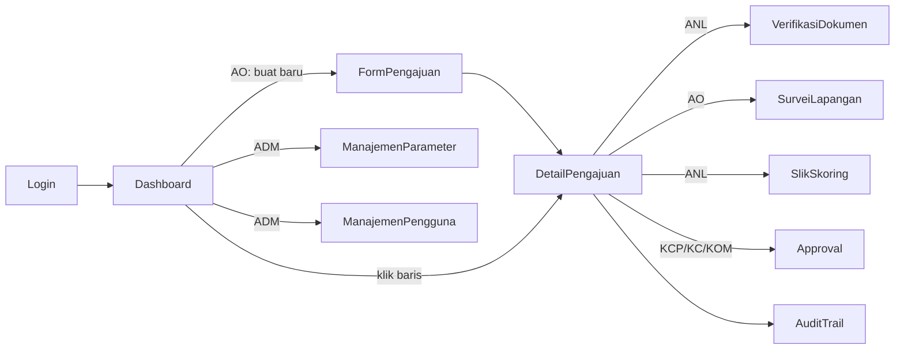

# SDD — iMitra (Software Design Document)

**Dokumen**: Software Design Document
**Sistem**: iMitra
**Tim**: iMitra Tim 1
**Versi**: 1.0.0
**Tanggal**: 2026-08-20
**Penyusun**: Irgiyansyah (pemilik berkas), BAB 5 disusun bersama Rayvaldo; disetujui Luthfi (Tech Lead)

---

## BAB 1 — DESIGN OVERVIEW

### 1.1 Tujuan Dokumen

Dokumen ini menjelaskan bagaimana requirement pada SRS iMitra (FR-01 s.d. FR-18, BR-01 s.d.
BR-12, AC-01 s.d. AC-15) diwujudkan menjadi arsitektur, model data, dan API yang konkret.
Dokumen ini menjadi rujukan utama saat memberi konteks ke AI coding agent maupun saat
onboarding anggota tim baru, sehingga keputusan desain tidak perlu diterka ulang dari kode.
Lingkupnya adalah rilis hackathon (bukan rilis produksi) sebagaimana dibatasi di SRS §1.2/2.4.

### 1.2 Prinsip Desain yang Kami Pegang

- Aturan bisnis (BR-01 s.d. BR-12) hanya hidup di lapisan service; controller/handler tidak
  memutuskan apa pun selain validasi format request dan pemetaan HTTP status.
- Parameter bisnis (bobot skor, ambang approval, rentang margin) dibaca dari database di
  setiap pemakaian, tidak di-cache di proses, supaya AC-15 terpenuhi tanpa restart aplikasi.
- Otorisasi peran diperiksa di server pada setiap request lewat middleware, dan pemisahan
  maker/checker (BR-09) diperiksa terpisah di service dengan membandingkan identitas pembuat
  pengajuan terhadap identitas approver — bukan cukup dari peran.
- Transisi status pengajuan hanya boleh terjadi lewat satu modul state machine; modul lain
  memanggilnya, tidak menulis kolom `status` secara langsung, supaya BR-10 (aktor + timestamp
  di setiap transisi) selalu konsisten dan tidak ada jalur yang lupa mencatat audit trail.
- Skema database berasal semata dari berkas migrasi SQL, tidak pernah dari `AutoMigrate`,
  supaya skema reproducible persis di mesin penilai.
- Semua nilai NIK dimasker sebelum masuk log, pesan error, atau URL (BR-11); tidak ada jalur
  kode yang menulis NIK mentah ke `stdout`/`stderr`.

### 1.3 Ringkasan Keputusan Teknologi

Alasan lengkap tiap pilihan ada di `docs/adr/0001-pilihan-stack.md` — di sini hanya ringkasan.

| Lapisan | Teknologi | Versi |
|---|---|---|
| Backend | Go, Gin (HTTP router), GORM (query builder saja, `AutoMigrate` dimatikan) | Go 1.22, Gin 1.10.x, GORM 1.25.x |
| Frontend | React + TypeScript + Vite, TailwindCSS | React 18, Vite 5.x |
| Database | PostgreSQL | 16-alpine |
| Mock SLIK | Node.js + Express, layanan HTTP terpisah (brief §7.2 butir 3) | Node 20 LTS, Express 4.x |

---

## BAB 2 — HIGH-LEVEL ARCHITECTURE

### 2.1 Diagram Komponen



### 2.2 Lapisan di Dalam Backend

| Lapisan | Tanggung jawab | Boleh memanggil | Tidak boleh |
|---|---|---|---|
| Handler (controller) | Parsing & validasi format request, memanggil satu service, memetakan hasil/`error` ke HTTP status (BAB 5.1) | Service | Repository, database, keputusan bisnis apa pun |
| Service | Seluruh aturan bisnis BR-01..BR-12, orkestrasi transaksi lintas tabel, memanggil State Machine dan SLIK Client | Repository, State Machine, SLIK Client, Audit Trail Writer | Menulis SQL langsung, dipanggil dari service lain secara silang tanpa lewat interface |
| State Machine | Validasi transisi status pengajuan yang sah (Bab 3.2 SRS), menolak transisi ilegal | Audit Trail Writer (untuk mencatat transisi), Repository (baca status saat ini) | Dipanggil langsung oleh handler |
| Repository | Akses data ke PostgreSQL via GORM sebagai query builder, tanpa logika bisnis | Database | AutoMigrate, dipanggil oleh handler |
| SLIK Client | Memanggil `mock-slik` via HTTP dengan timeout, memetakan 200/404/503/timeout ke tipe hasil internal | HTTP ke `mock-slik` | Menyimpan langsung ke database (hasil dikembalikan ke Service) |

### 2.3 Di Mana Setiap Aturan Bisnis Ditegakkan

Pemetaan lengkap BR → modul ada di `AGENTS.md` bagian 5 dan `docs/TRACEABILITY.md` — di sini
hanya keputusan desainnya: seluruh BR yang berkaitan dengan transisi status (BR-02, BR-05,
BR-09) ditegakkan di satu modul State Machine, bukan tersebar di controller per endpoint.
Aturan validasi input tunggal (BR-01, BR-06, BR-12) ditegakkan di lapisan Service saat
pengajuan dibuat/diubah, sebelum data disimpan. Aturan yang berkaitan dengan integritas
catatan (BR-10, BR-11, BR-13-append-only) ditegakkan oleh satu modul Audit Trail Writer yang
dipanggil oleh State Machine dan Service — tidak ada modul lain yang menulis ke tabel
`audit_trail`.

### 2.4 Penanganan Kegagalan Integrasi SLIK

Timeout dibaca dari environment variable `SLIK_TIMEOUT_MS` (default 5000 ms, lihat
`.env.example`) — bukan konstanta di kode, supaya bisa diperpendek saat demo jalur error.
Tidak ada retry otomatis: percobaan SLIK yang gagal (503 atau timeout) dicatat sebagai baris
`hasil_slik` dengan `status_panggilan = SERVICE_UNAVAILABLE` atau `TIMEOUT`, dan pengajuan
**tetap** di status berjalan (tidak otomatis `REJECTED_SLIK`) karena kegagalan panggilan bukan
sinyal kolektibilitas buruk. ANL harus menekan "Jalankan SLIK Check" lagi secara sadar — sistem
tidak boleh diam-diam menganggap SLIK bersih maupun otomatis mengulang tanpa sepengetahuan
ANL. Kegagalan 404 (`NIK_NOT_FOUND`) dicatat serupa dan ditampilkan sebagai pesan yang meminta
ANL memeriksa kembali NIK yang diinput (tanpa menuliskan NIK penuh di pesan, BR-11).

---

## BAB 3 — UML DESIGN

### 3.1 Class Diagram / Entity Relationship



Satu pengajuan mewakili nasabah perorangan bila `tipe = INDIVIDU` (tanpa baris
`pengajuan_anggota`), atau kelompok/majelis 3–10 anggota bila `tipe = KELOMPOK` (satu baris
`pengajuan_anggota` per anggota, masing-masing dengan `plafon_anggota` sendiri). Total plafon
kelompok adalah `SUM(plafon_anggota) WHERE status_anggota = 'AKTIF'`, dihitung ulang oleh
Service setiap kali status anggota berubah — inilah yang memenuhi AC-14: saat satu anggota
ditolak, `status_anggota` diubah menjadi `DITOLAK`, total plafon dihitung ulang, dan level
approval yang dibutuhkan (Tabel 4.1 di Bab 4 SDD) dievaluasi ulang dari total yang baru.

### 3.2 Sequence Diagram — Approval Berjenjang



### 3.3 Sequence Diagram — SLIK Check dan Jalur Error



### 3.4 Diagram Lain — Activity Diagram Skoring



---

## BAB 4 — DATABASE DESIGN

### 4.1 Daftar Tabel

| Table | Field | Type | Description |
|---|---|---|---|
| `pengguna` | `id` | `BIGSERIAL` PK | |
| | `nama` | `VARCHAR(150)` | |
| | `email` | `VARCHAR(150)` UNIQUE | Dipakai sebagai username login |
| | `password_hash` | `VARCHAR(255)` | bcrypt, lihat Bab 7 |
| | `peran` | `VARCHAR(8)` | `AO/ANL/KCP/KC/KOM/ADM`, CHECK constraint |
| | `aktif` | `BOOLEAN` default `TRUE` | Nonaktifkan tanpa hapus baris |
| | `dibuat_pada` | `TIMESTAMPTZ` | |
| `pengajuan` | `id` | `BIGSERIAL` PK | |
| | `nomor_referensi` | `VARCHAR(20)` UNIQUE | Format `IMT-YYYYMMDD-NNNN` (BR-12); di-generate di Service dalam transaksi DB dengan `SELECT ... FOR UPDATE` pada counter harian supaya tidak pernah dipakai ulang |
| | `tipe` | `VARCHAR(9)` | `INDIVIDU` / `KELOMPOK` |
| | `ao_id` | `BIGINT` FK → `pengguna` | Maker; dipakai untuk cek BR-09 |
| | `nama_nasabah`, `nik`, `alamat_usaha` | `VARCHAR` | NIK tidak pernah ditulis ke log/URL (BR-11) |
| | `jenis_akad` | `VARCHAR(11)` | `MURABAHAH` / `MUSYARAKAH` |
| | `plafon_diajukan`, `plafon_disetujui` | `BIGINT` | Rupiah, tanpa desimal |
| | `margin_atau_nisbah` | `NUMERIC(6,2)` | Nullable sampai FR-07 dijalankan |
| | `status` | `VARCHAR(20)` | Lihat state machine SRS Bab 3.2 |
| | `dibuat_pada`, `diperbarui_pada` | `TIMESTAMPTZ` | |
| `pengajuan_anggota` | `id` | `BIGSERIAL` PK | |
| | `pengajuan_id` | `BIGINT` FK → `pengajuan` | |
| | `nama_anggota`, `nik_anggota` | `VARCHAR` | |
| | `plafon_anggota` | `BIGINT` | Dipakai hitung ulang total (AC-14) |
| | `status_anggota` | `VARCHAR(8)` | `AKTIF` / `DITOLAK` |
| `dokumen` | `id` | `BIGSERIAL` PK | |
| | `pengajuan_id` | `BIGINT` FK → `pengajuan` | |
| | `jenis_dokumen` | `VARCHAR(30)` | `KTP`, `KK`, `NPWP`, dll |
| | `url_berkas` | `VARCHAR(255)` | Path relatif, akses lewat endpoint terautentikasi (Bab 7) |
| | `status` | `VARCHAR(10)` | `UPLOADED` / `VERIFIED` / `REJECTED` |
| | `alasan_penolakan` | `VARCHAR(255)` | Wajib diisi bila `REJECTED` |
| | `diverifikasi_oleh`, `diverifikasi_pada` | FK `pengguna` / `TIMESTAMPTZ` | |
| `survei` | `id` | `BIGSERIAL` PK | |
| | `pengajuan_id`, `ao_id` | `BIGINT` FK | |
| | `latitude`, `longitude` | `NUMERIC(9,6)` | Direkam dari Geolocation API browser (Bab 5.3) |
| | `foto_url` | `VARCHAR(255)` | |
| | `status` | `VARCHAR(11)` | `VALID` / `TIDAK_VALID` |
| `hasil_slik` | `id` | `BIGSERIAL` PK | |
| | `pengajuan_id` | `BIGINT` FK | |
| | `kolektibilitas`, `jumlah_fasilitas_aktif` | `SMALLINT` | Nullable bila panggilan gagal |
| | `total_baki_debet` | `BIGINT` | |
| | `tanggal_data` | `DATE` | Dari respons mock SLIK |
| | `reference_id` | `VARCHAR(50)` | Dari respons mock SLIK |
| | `status_panggilan` | `VARCHAR(20)` | `SUKSES` / `NIK_NOT_FOUND` / `SERVICE_UNAVAILABLE` / `TIMEOUT` |
| | `berlaku_sampai` | `DATE` | `tanggal_data + 30 hari` (BR-04) |
| | `dibuat_pada` | `TIMESTAMPTZ` | |
| `hasil_skoring` | `id` | `BIGSERIAL` PK | |
| | `pengajuan_id` | `BIGINT` FK UNIQUE | Satu hasil aktif per pengajuan |
| | `skor_akhir` | `SMALLINT` | Hasil BR-07, dibulatkan |
| | `grade` | `SMALLINT` | 1–5, dari `rentang_margin` |
| | `dihitung_oleh` | `BIGINT` FK `pengguna` | |
| | `override_oleh`, `alasan_override` | FK `pengguna` / `VARCHAR(255)` | Wajib diisi kalau ANL override (AC-08) |
| | `dibuat_pada` | `TIMESTAMPTZ` | |
| `rincian_komponen_skor` | `id` | `BIGSERIAL` PK | |
| | `hasil_skoring_id` | `BIGINT` FK | |
| | `kode_komponen` | `VARCHAR(32)` FK → `parameter_skoring` | |
| | `nilai_input` | `NUMERIC(14,4)` | Nilai mentah sebelum dikonversi skor |
| | `skor_komponen`, `bobot_dipakai` | `NUMERIC(6,2)` | Snapshot saat dihitung, bukan hanya skor akhir (BR-08) |
| `keputusan_approval` | `id` | `BIGSERIAL` PK | |
| | `pengajuan_id` | `BIGINT` FK | |
| | `level` | `VARCHAR(8)` | `KCP`/`KC`/`KOM` |
| | `approver_id` | `BIGINT` FK `pengguna` | Dicek terhadap `ao_id` untuk BR-09 |
| | `keputusan` | `VARCHAR(7)` | `APPROVE` / `REJECT` |
| | `catatan` | `VARCHAR(500)` | |
| | `diputuskan_pada` | `TIMESTAMPTZ` | |
| `audit_trail` | `id` | `BIGSERIAL` PK | |
| | `pengajuan_id` | `BIGINT` FK | |
| | `aktor_id` | `BIGINT` FK `pengguna` | Tidak pernah `NULL` (BR-10) |
| | `aksi` | `VARCHAR(50)` | mis. `SUBMIT`, `SLIK_CHECK`, `APPROVE_KCP` |
| | `status_sebelum`, `status_sesudah` | `VARCHAR(20)` | |
| | `detail` | `JSONB` | Payload tambahan (mis. alasan override), tanpa NIK/foto mentah |
| | `dibuat_pada` | `TIMESTAMPTZ` | Append-only, lihat Bab 4.4 |
| `notifikasi` | `id` | `BIGSERIAL` PK | |
| | `pengguna_id`, `pengajuan_id` | `BIGINT` FK | |
| | `pesan` | `VARCHAR(255)` | |
| | `dibaca` | `BOOLEAN` default `FALSE` | |
| | `dibuat_pada` | `TIMESTAMPTZ` | |
| `parameter_skoring` | `kode` | `VARCHAR(32)` PK | Kode komponen: `KAPASITAS_BAYAR`, `RIWAYAT_SLIK`, `LAMA_USAHA`, `SURVEI_LAPANGAN` |
| | `nama` | `VARCHAR(100)` | Nama yang ditampilkan ke ANL pada rincian skor (BR-08) |
| | `bobot` | `NUMERIC(6,2)` | Bobot komponen. Dapat diubah ADM tanpa deploy ulang (AC-15) |
| | `batas_1`, `batas_2` | `NUMERIC(12,4)` | Ambang skor penuh / skor nol. Satuan bergantung komponen: rasio untuk `KAPASITAS_BAYAR`, bulan untuk `LAMA_USAHA` |
| | `aktif` | `BOOLEAN` | Komponen tidak aktif diabaikan saat menghitung |
| `parameter_riwayat_slik` | `kolektibilitas` | `SMALLINT` PK | 1–5. Kol 3–5 **sengaja tidak di-seed**: pengajuannya sudah `REJECTED_SLIK` sebelum skoring, dan tidak adanya baris membuat skoring berhenti alih-alih memakai nilai default |
| | `skor` | `NUMERIC(6,2)` | Skor komponen SLIK: Kol-1 → 100, Kol-2 → 40 (Tabel 4.2) |
| `parameter_umum` | `kunci` | `VARCHAR(64)` PK | `hari_kerja_per_bulan`, `margin_usaha` — pengali rumus kapasitas bayar (§4.4), disimpan sebagai data supaya angka 25 dan 0,30 tidak ada di dalam kode |
| | `nilai` | `NUMERIC(14,4)` | Nilai parameter |
| `ambang_approval` | `id` | `BIGSERIAL` PK | |
| | `plafon_min`, `plafon_maks` | `BIGINT` | Rentang **tertutup** total plafon. Constraint `EXCLUDE USING gist` mencegah rentang tumpang tindih — kalau tumpang tindih, level approval jadi ambigu |
| | `level` | `VARCHAR(8)[]` | Urutan array = urutan approval (BR-02), mis. `{KCP,KC}` |
| `rentang_margin` | `grade` | `SMALLINT` PK | 1–5 |
| | `skor_min`, `skor_maks` | `SMALLINT` | Rentang skor → grade (Tabel 4.3). Dibaca service untuk menurunkan grade; tidak ada rentang yang ditulis di kode |
| | `margin_min`, `margin_maks` | `NUMERIC(6,2)` | Rentang margin murabahah. `NULL` untuk grade 5 |
| | `nisbah_min`, `nisbah_maks` | `NUMERIC(6,2)` | Rentang nisbah bank musyarakah. `NULL` untuk grade 5 |
| | `dapat_dibiayai` | `BOOLEAN` | `FALSE` untuk grade 5 → memicu BR-05, bukan dibandingkan dengan angka 5 di kode |

### 4.2 Strategi Migrasi

**Tool**: golang-migrate 4.17.x. Skema **hanya** berasal dari berkas migrasi SQL —
`gorm.AutoMigrate` dilarang (`AGENTS.md` Larangan 16), karena skema yang dibangun dari kode
Go tidak reproducible di mesin penilai.

**Konvensi nama**: `NNNNNN_nama_singkat.up.sql` dan `.down.sql`, nomor urut 6 digit, di
`backend/migrations/`. Setiap `up` wajib punya `down` yang benar-benar diuji, bukan berkas
kosong.

**Siapa yang boleh membuat migrasi baru**: DevOps / Release (Irgiyansyah) sebagai pemilik
`backend/migrations/` di `.github/CODEOWNERS`. Satu pemilik supaya dua migrasi tidak
bertabrakan pada nomor urut yang sama.

**Migrasi yang sudah di-merge ke `main` tidak boleh diubah atau dihapus** (`AGENTS.md`
Larangan 2). Perubahan skema selalu berupa migrasi baru dengan nomor berikutnya.

Migrasi yang sudah ada:

| Berkas | Isi |
|---|---|
| `000001_parameter.up.sql` | Tabel `parameter_skoring`, `parameter_riwayat_slik`, `parameter_umum`, `rentang_margin`, `ambang_approval` beserta constraint-nya |
| `000002_seed_parameter.up.sql` | Nilai awal kelima tabel di atas, dari brief §4.1/4.2/4.3/4.4 |
| `000003_core_domain.up.sql` | Tabel `pengguna`, `pengajuan`, `pengajuan_anggota`, `dokumen`, `survei`, `hasil_slik`, `hasil_skoring`, `rincian_komponen_skor`, `keputusan_approval`, `audit_trail`, `notifikasi`, beserta FK dan CHECK constraint peran/status |

**Diverifikasi**: ketiga migrasi dijalankan pada `postgres:16-alpine`, `down` diuji
mengembalikan database ke keadaan tanpa tabel, dan constraint `EXCLUDE USING gist` terbukti
menolak rentang plafon yang tumpang tindih.

### 4.3 Seed Data

**Parameter awal** (sudah ada, `000002_seed_parameter.up.sql`): bobot & ambang keempat
komponen skor, pemetaan kolektibilitas → skor, pengali rumus kapasitas bayar, rentang
margin/nisbah per grade, dan ambang approval per total plafon.

**Cara idempotensinya dijamin**: setiap `INSERT` memakai `ON CONFLICT ... DO NOTHING`,
**bukan** `DO UPDATE`. Ini keputusan sadar: kalau seed menimpa nilai yang ada, perubahan
bobot yang dibuat ADM saat demo AC-15 akan ter-reset diam-diam pada restart berikutnya,
dan AC-15 justru jadi tidak bisa dibuktikan. Diverifikasi dengan menjalankan seed dua kali
pada database yang sama — tanpa error, jumlah baris tetap.

Yang **belum** di-seed dan siapa pemiliknya (lihat `README.md` bagian 1):

| Yang di-seed | Pemilik | Untuk AC |
|---|---|---|
| Pengguna per peran (AO, ANL, KCP, KC, KOM, ADM) | Yulio Zaki (FR-01) | AC-01, AC-02 |
| Data SLIK dari `fixtures/nasabah-uji.csv` | Yulio Zaki (mock SLIK) | AC-05, AC-06 |
| Pengajuan contoh untuk riwayat lengkap | Rayvaldo (FR-02) | AC-12 |
| Pengajuan kelompok 4 anggota | Rayvaldo (FR-10) | AC-14 |

### 4.4 Bagaimana Audit Trail Dijaga Append-Only

Tabel `audit_trail` tidak memiliki endpoint `PATCH`/`PUT`/`DELETE` di lapisan API — hanya
`POST` (ditulis internal oleh State Machine dan Audit Trail Writer, tidak diekspos langsung
ke klien) dan `GET` untuk membaca riwayat satu pengajuan. Sebagai lapisan kedua, role
database yang dipakai backend (`imitra_app`) tidak diberi hak `UPDATE`/`DELETE` pada tabel
ini — hanya `INSERT` dan `SELECT` — lewat `GRANT` eksplisit di migrasi `000003`, sehingga
bahkan bug di kode Go tidak bisa mengubah/menghapus baris. AC-13 dibuktikan dengan menjalankan
`GET /api/routes` (daftar route yang didaftarkan Gin saat startup, dicetak ke log) dan
menunjukkan tidak ada route dengan method selain `GET`/`POST` yang menyentuh path
`/audit-trail`.

---

## BAB 5 — API DESIGN

| Endpoint | Method | Auth | Description |
|---|---|---|---|
| `/api/auth/login` | POST | Publik | Login dengan email + password, mengembalikan JWT access token |
| `/api/auth/me` | GET | AO/ANL/KCP/KC/KOM/ADM | Info identitas & peran dari token yang sedang dipakai |
| `/api/pengajuan` | POST | AO | Membuat pengajuan baru (individu atau kelompok), generate nomor referensi (BR-12) |
| `/api/pengajuan` | GET | AO/ANL/KCP/KC/KOM | Daftar pengajuan sesuai lingkup peran (AO: miliknya; ANL: semua; approver: yang menunggu levelnya) |
| `/api/pengajuan/:id` | GET | AO/ANL/KCP/KC/KOM | Detail satu pengajuan |
| `/api/pengajuan/:id/dokumen` | POST | AO | Upload dokumen (multipart) |
| `/api/pengajuan/:id/dokumen/:dokId/verifikasi` | PATCH | ANL | Verifikasi/tolak dokumen dengan kode alasan (AC-03) |
| `/api/pengajuan/:id/survei` | POST | AO | Rekam survei OTS: koordinat, foto, catatan |
| `/api/pengajuan/:id/slik-check` | POST | ANL | Jalankan pengecekan SLIK (memanggil mock-slik) |
| `/api/pengajuan/:id/skoring` | POST | ANL | Hitung skoring (BR-03 dicek dulu, BR-07/BR-08 dijalankan) |
| `/api/pengajuan/:id/skoring/override` | PATCH | ANL | Override grade dengan alasan wajib (AC-08) |
| `/api/pengajuan/:id/margin` | POST | ANL | Tentukan margin/nisbah, diblokir bila di luar rentang grade (BR-06) |
| `/api/pengajuan/:id/submit-approval` | POST | ANL | Ajukan ke jalur approval, tentukan level dari total plafon (Tabel 4.1) |
| `/api/pengajuan/:id/approval/:level/keputusan` | POST | KCP/KC/KOM | APPROVE/REJECT pada levelnya; server memeriksa BR-02 & BR-09 |
| `/api/pengajuan/:id/audit-trail` | GET | AO/ANL/KCP/KC/KOM/ADM | Riwayat lengkap urut waktu (AC-12) |
| `/api/parameter/:kelompok` | GET | ADM (baca: ANL juga diizinkan) | Baca tabel parameter (skoring/approval/margin) |
| `/api/parameter/:kelompok/:kode` | PUT | ADM | Ubah nilai parameter, berlaku tanpa restart (AC-15) |
| `/api/pengguna` | GET, POST | ADM | Kelola daftar pengguna & peran |
| `/api/dashboard/pipeline` | GET | AO/ANL/KCP/KC/KOM | Ringkasan pipeline pengajuan (FR-12) |
| `/api/notifikasi` | GET | AO/ANL/KCP/KC/KOM/ADM | Daftar notifikasi milik pengguna yang login |

**Endpoint mock SLIK** (kontrak dari brief §6.1, tidak boleh diubah):

| Endpoint | Method | Auth | Description |
|---|---|---|---|
| `/slik/inquiry` | POST | — | Inquiry kolektibilitas berdasarkan NIK. 200 / 404 `NIK_NOT_FOUND` / 503 `SERVICE_UNAVAILABLE` |

### 5.1 Bentuk Respons Error

Satu bentuk untuk seluruh API, sama dengan `AGENTS.md` bagian 4.3:

```json
{
  "error": {
    "code": "BR-05_GRADE_5_REJECTED",
    "message": "Pengajuan dengan grade 5 tidak dapat diajukan ke approval",
    "details": {}
  }
}
```

Pemetaan kode HTTP: `400` untuk kesalahan format request (field hilang/tipe salah), `401`
untuk token tidak ada/kedaluwarsa, `403` untuk pelanggaran peran atau kepemilikan (AC-02,
termasuk pelanggaran BR-09), `404` untuk resource tidak ditemukan, `409` untuk konflik state
(mis. approval level yang sama diputuskan dua kali), `422` untuk pelanggaran aturan bisnis
yang `error.code` diawali `BR-xx` (AC-04), dan `500` untuk kegagalan tak terduga (tanpa
membocorkan detail internal ke `message`).

### 5.2 Autentikasi & Otorisasi

Mekanisme: JWT (access token, masa berlaku 30 menit, ditandatangani `HS256` dengan secret dari
`JWT_SECRET` di environment). Token dikirim di header `Authorization: Bearer <token>` dan
disimpan di memori frontend (bukan `localStorage`) untuk memperkecil dampak XSS.

Peran diperiksa dua kali: (1) middleware Gin per grup route memeriksa `peran` di klaim JWT
terhadap daftar peran yang diizinkan endpoint tersebut (Bab 5 tabel di atas) — ini yang membuat
AC-02 selalu mengembalikan 403 untuk panggilan API langsung lintas peran; (2) di lapisan
Service untuk aturan yang tidak bisa diperiksa dari peran saja, khususnya BR-09: sebelum
menyimpan `keputusan_approval`, Service membandingkan `pengajuan.ao_id` (identitas maker) dan
seluruh `aktor_id` sebelumnya pada pengajuan yang sama dengan identitas approver dari token —
bila sama, request ditolak `403` dengan `error.code = BR-09_MAKER_CHECKER`.

---

## BAB 6 — UI/UX DESIGN

### 6.1 Daftar Layar per Peran

| Layar | Peran | Elemen utama | Catatan otorisasi |
|---|---|---|---|
| Login | Semua | Form email/password | Publik, redirect sesuai peran setelah login |
| Dashboard Pipeline | AO/ANL/KCP/KC/KOM | Daftar pengajuan dengan filter status | Data difilter server-side sesuai lingkup peran |
| Form Pengajuan Baru | AO | Form bertahap (individu / kelompok) | Hanya AO, `ao_id` diambil dari token, bukan dari body request |
| Detail Pengajuan | AO/ANL/KCP/KC/KOM | Ringkasan, dokumen, survei, SLIK, skoring, approval, riwayat | Tombol aksi disembunyikan sesuai peran, tetap divalidasi ulang di server |
| Verifikasi Dokumen | ANL | Viewer dokumen + tombol verifikasi/tolak + kode alasan | Endpoint hanya menerima peran ANL |
| Survei Lapangan | AO | Ambil koordinat, unggah foto, catatan | Dipakai di lapangan, mobile-first |
| SLIK & Skoring | ANL | Tombol jalankan SLIK, rincian komponen skor, override | Override wajib alasan, dicatat audit trail |
| Approval | KCP/KC/KOM | Ringkasan pengajuan pada level miliknya, tombol APPROVE/REJECT | Tombol hanya aktif untuk level & pengajuan yang levelnya sudah tiba (BR-02); server tetap memvalidasi BR-09 |
| Manajemen Parameter | ADM | Tabel parameter skoring/approval/margin, form edit | Hanya ADM; perubahan berlaku langsung (AC-15) |
| Manajemen Pengguna | ADM | Daftar pengguna, tambah/nonaktifkan | Hanya ADM |
| Audit Trail | AO/ANL/KCP/KC/KOM/ADM | Riwayat kronologis satu pengajuan | Read-only untuk semua peran yang berwenang melihat pengajuan tsb |

### 6.2 Alur Navigasi



### 6.3 Keputusan UX Khusus iMitra

Rincian komponen skor ditampilkan ke ANL sebagai tabel per komponen (nama, nilai input, skor,
bobot, kontribusi ke skor akhir) — bukan hanya angka akhir — persis struktur
`rincian_komponen_skor`, supaya analis bisa mempertanggungjawabkannya ke auditor tanpa
membuka database (BR-08, AC-07). AO merekam koordinat survei otomatis lewat Geolocation API
browser saat form survei dibuka di lokasi, dengan foto diunggah langsung dari kamera perangkat;
kedua nilai disimpan sebagai pasangan `latitude/longitude` dan bukan alamat yang diketik manual,
supaya tidak bisa direkayasa dari kantor. Form pengajuan kelompok memakai pola "tambah baris
anggota" dinamis (1 baris ringkas per anggota: nama, NIK, plafon) di dalam satu langkah wizard,
bukan form terpisah per anggota, supaya tetap ringkas untuk 3–10 anggota. Pesan pelanggaran
aturan bisnis ditampilkan dua lapis: judul singkat berbahasa manusia ("Margin di luar batas
grade ini") dengan kode `BR-xx` kecil di bawahnya agar bisa dirujuk saat audit tanpa
membingungkan pengguna awam.

### 6.4 Catatan Aksesibilitas & Responsif

Frontend dibangun mobile-first (breakpoint utama di 375px) karena AO bekerja di lapangan
dengan layar kecil dan koneksi yang bisa lambat; web responsif dianggap cukup, mobile native
di luar lingkup (brief §1.4). Ukuran tombol aksi minimal 44×44px untuk kemudahan sentuh, dan
form survei menampilkan indikator loading yang jelas saat menunggu GPS/upload foto pada
koneksi lambat.

---

## BAB 7 — SECURITY DESIGN

| Aspek | Rancangan | Cara diverifikasi |
|---|---|---|
| Penyimpanan password | `bcrypt` cost factor 12 | Review kode `pengguna` service + memastikan tidak ada password plaintext di seed/log |
| Sesi / token | JWT `HS256`, masa berlaku 30 menit, disimpan di memori frontend (bukan `localStorage`); pencabutan lewat penonaktifan `pengguna.aktif` yang diperiksa ulang tiap request | Uji: nonaktifkan pengguna, token lama harus ditolak `401` pada request berikutnya |
| Otorisasi per endpoint | Middleware peran per grup route Gin, daftar peran eksplisit per endpoint (Bab 5) | AC-02 (panggilan API langsung harus 403) |
| Pemisahan maker/checker (BR-09) | Perbandingan `ao_id` pengajuan vs identitas approver di Service sebelum menyimpan `keputusan_approval` | AC-11 |
| Perlindungan data pribadi (BR-11) | NIK dimasker (`340xxxxxxxxxxx1234` → `3404******1234`) di seluruh log terstruktur, pesan error, dan tidak pernah dipakai sebagai bagian URL (dipakai body JSON saja); akses foto dokumen/survei lewat endpoint `GET /api/dokumen/:id/berkas` yang memeriksa otorisasi, bukan path statis langsung | Inspeksi log aplikasi setelah menjalankan skenario demo lengkap, memastikan tidak ada NIK utuh muncul |
| Akses berkas upload | Tidak ada folder upload yang di-`serve` statis; setiap unduhan lewat endpoint terautentikasi yang memeriksa kepemilikan/peran atas pengajuan terkait | Uji: akses URL berkas langsung tanpa token harus `401`/`403` |
| Audit trail append-only | Tidak ada route `PATCH`/`DELETE`; hak `UPDATE`/`DELETE` dicabut dari role DB aplikasi (Bab 4.4) | AC-13 |
| Manajemen secret | `.env.example` di repo berisi nama variabel tanpa nilai rahasia; `.env` di `.gitignore`; nilai dibaca lewat `os.Getenv` di startup, gagal cepat (`fatal`) bila wajib tapi kosong | Pemeriksaan `git log -- .env` kosong, dan `git grep` tidak menemukan secret literal |
| Validasi input | Validasi struct request di lapisan handler (format, tipe, panjang) sebelum diteruskan ke Service; validasi aturan bisnis di Service | Unit test per endpoint untuk payload tidak valid |

**Yang secara sadar tidak kami tangani di rilis ini** (dan mengapa aman untuk konteks
hackathon): rate limiting per endpoint, enkripsi at-rest untuk kolom NIK, dan rotasi kunci
JWT. Untuk demo dan penilaian dalam jangka waktu singkat dengan data uji, risiko ini diterima
secara sadar; dicatat di sini supaya dianggap keputusan, bukan celah yang terlewat.

---

## BAB 8 — DEPLOYMENT DESIGN

### 8.1 Topologi Docker Compose

| Service | Image / build | Port host:container | Bergantung pada | Healthcheck |
|---|---|---|---|---|
| `backend` | build dari `backend/Dockerfile` (Go 1.22) | `8080:8080` | `db` (healthy), `mock-slik` (started) | `GET /healthz` |
| `frontend` | build dari `frontend/Dockerfile` (Node 20 → nginx statis) | `3000:80` | `backend` (started) | `GET /` |
| `mock-slik` | build dari `mock-slik/Dockerfile` (Node 20) | `8081:8081` | — | `GET /healthz` |
| `db` | `postgres:16-alpine` | `5432:5432` | — | `pg_isready` |

### 8.2 Variabel Lingkungan

Nilai lengkap ada di `.env.example` di root repo — tidak disalin ke sini supaya tidak ada dua
sumber kebenaran. Yang wajib diubah sebelum menjalankan di luar demo: `JWT_SECRET` dan
`POSTGRES_PASSWORD`. Yang boleh dibiarkan default untuk demo: `SLIK_TIMEOUT_MS`, port host,
dan `SLIK_FAILURE_RATE` (dipakai `mock-slik` untuk mensimulasikan 503, lihat Bab 8.3).

### 8.3 Urutan Startup

Urutan: `db` naik dan lolos `pg_isready` → `backend` menjalankan migrasi (`golang-migrate up`)
dan seed sebagai langkah `entrypoint` sebelum proses HTTP dimulai, menunggu `db` healthy lewat
`depends_on: condition: service_healthy` di compose (bukan `sleep`) → `mock-slik` naik paralel
(tidak bergantung pada `db`) → `frontend` naik terakhir dan hanya butuh `backend` berstatus
started, karena panggilan API dilakukan dari browser klien, bukan saat build/start container.
Ini yang mencegah kegagalan khas "jalan di laptop saya, gagal di mesin penilai" akibat backend
mencoba konek ke database yang belum siap.

### 8.4 CI

CI (GitHub Actions) berjalan pada setiap `push` dan `pull_request` ke `main`, terdiri dari tiga
job paralel: `lint` (`golangci-lint` untuk backend, `eslint` untuk frontend), `test` (`go test
./...` dengan Postgres service container untuk migrasi, `vitest` untuk frontend), dan `build`
(`docker compose build` seluruh service). Total waktu target di bawah 8 menit. CI merah pada
tag `v1.0.0` dikenai pengurangan -5, sehingga tag hanya dibuat setelah run terakhir di `main`
hijau.

### 8.5 Rilis

Tag `v1.0.0` dibuat Jumat pukul 15.00 oleh Irgiyansyah (DevOps/Release). Checklist sebelum tag:
CI hijau di commit yang akan di-tag, `docker compose up` berhasil dari clone bersih, seluruh
AC-01 s.d. AC-13 (P0) lolos di `docs/DEMO-SCRIPT.md`, blok "Baca ini dulu" di SRS/SDD sudah
dihapus, dan `.env` tidak ikut ter-commit.

---

## Riwayat Revisi

| Versi | Tanggal | Oleh | Perubahan |
|---|---|---|---|
| 1.0.0 | 2026-08-20 | Irgiyansyah | Versi awal — seluruh bab diisi berdasarkan SRS iMitra v1.0 |