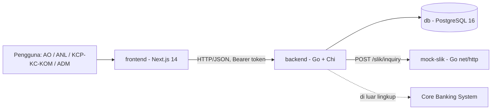
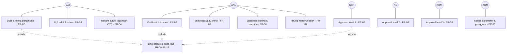
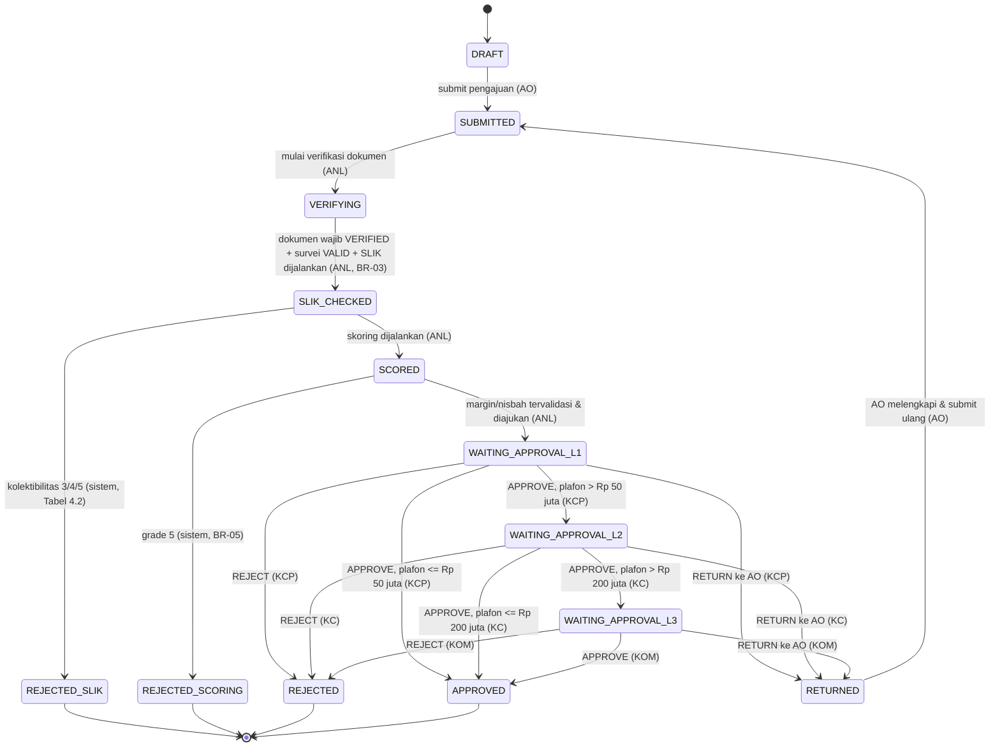

# SRS — iMitra (Sistem Originasi Pembiayaan Mikro Syariah)

**Dokumen**: Software Requirements Specification
**Sistem**: iMitra
**Tim**: iMitra Tim 1
**Versi**: 1.0
**Tanggal**: 2026-08-20
**Penyusun**: Yulio Zaki (pemilik dokumen ini), dengan rujukan ke `01-BRIEF-Hackathon-iMitra.md` dan `AGENTS.md` yang disepakati seluruh anggota tim iMitra Tim 1

---

## BAB 1 — INTRODUCTION

### 1.1 Purpose

Dokumen ini menetapkan kebutuhan fungsional dan non-fungsional untuk iMitra, sistem
originasi pembiayaan mikro syariah yang mengotomasi alur pengajuan Account Officer (AO)
hingga approval berjenjang. Tujuannya menyamakan pemahaman tim tentang *apa* yang dibangun
dan aturan bisnis yang mengikatnya, sebelum kode ditulis — termasuk oleh AI assistant, yang
memakai dokumen ini dan `AGENTS.md` sebagai konteks utama. Versi ini adalah ringkasan
turunan dari `01-BRIEF-Hackathon-iMitra.md` §1–§6, difokuskan pada apa yang benar-benar
dibangun tim dalam jendela waktu hackathon (±9 jam koding bersih).

### 1.2 Scope

**Termasuk dalam rilis ini** (mengikuti prioritas brief §3 — P0 wajib, P1 ditargetkan tuntas):

- FR-01 Autentikasi & Otorisasi Berbasis Peran
- FR-02 Pengajuan Pembiayaan Mikro
- FR-03 Upload & Verifikasi Dokumen
- FR-04 Survei Lapangan (OTS)
- FR-05 SLIK Check (mock, via HTTP)
- FR-06 Skoring Kelayakan Mikro
- FR-07 Perhitungan Margin / Nisbah
- FR-08 Approval Berjenjang
- FR-09 Audit Trail (append-only)
- FR-10 Pembiayaan Kelompok (Majelis)
- FR-11 Notifikasi Perubahan Status
- FR-12 Dashboard Pipeline
- FR-13 Parameter Terkonfigurasi (ADM)

FR-14 s/d FR-18 (P2: simulasi angsuran, ekspor CSV, mode draft offline, deteksi lokasi
palsu, laporan turn-around time) adalah kandidat tambahan — **hanya dikerjakan kalau
seluruh P0 dan P1 di atas sudah tuntas dan teruji** (brief §3.3). Kalau salah satunya
dibuang di Gate 3, statusnya dicatat sebagai "Dibuang" di `README.md` bagian 5 dan
`docs/TRACEABILITY.md`, bukan dihapus dari daftar ini.

**Tidak termasuk** (brief §1.4 — scope creep bila dibangun):

- Pencairan (disbursement), akuntansi, jadwal angsuran aktual, penagihan, restrukturisasi
- Integrasi nyata ke Core Banking System atau SLIK produksi (hanya mock, lihat §6.1 brief / Bab 5.2)
- Aplikasi mobile native (web responsif cukup; *mobile-first* boleh jadi pilihan desain untuk AO lapangan)
- SSO / Active Directory nyata (autentikasi lokal saja, lihat §6.3 brief)
- Multi-tenant, multi-currency, multi-bahasa

### 1.3 Definitions, Acronyms, and Abbreviations

| Istilah | Definisi |
|---|---|
| AO | Account Officer Mikro — membuat dan mengubah pengajuan miliknya, upload dokumen, merekam survei |
| ANL | Analis Mikro — verifikasi dokumen, SLIK check, skoring & override, perhitungan margin |
| KCP | Kepala Cabang Pembantu — approval level 1 |
| KC | Kepala Cabang — approval level 2 |
| KOM | Komite Pembiayaan — approval level 3 |
| ADM | Admin — kelola pengguna dan parameter |
| SLIK | Sistem Layanan Informasi Keuangan; sumber data kolektibilitas nasabah (di sistem ini: mock) |
| Kolektibilitas | Kualitas pembiayaan nasabah, skala 1–5 |
| OTS | On-The-Spot; survei lapangan di tempat usaha nasabah |
| Majelis | Kelompok nasabah 3–10 anggota dengan tanggung renteng |
| Murabahah | Akad jual beli dengan margin |
| Musyarakah | Akad kerja sama dengan nisbah bagi hasil |
| Plafon | Batas pembiayaan yang diajukan/disetujui |
| Maker / Checker | Pembuat / penyetuju; satu orang tidak boleh keduanya pada pengajuan yang sama |
| BR | Business Rule / Aturan Bisnis — nomor rujukan aturan wajib di brief §4 dan Bab 6 dokumen ini |
| FR | Functional Requirement — nomor rujukan kebutuhan fungsional di brief §3 dan Bab 3 dokumen ini |
| AC | Acceptance Criteria — kriteria uji yang dipakai penilai saat demo, brief §5 dan Bab 7 dokumen ini |
| IMT | Prefix nomor referensi pengajuan iMitra, format `IMT-YYYYMMDD-NNNN` (BR-12) |

### 1.4 References

| Dokumen | Keterangan |
|---|---|
| Brief Hackathon iMitra (`01-BRIEF-Hackathon-iMitra.md`) | Sumber utama seluruh requirement, aturan bisnis, dan acceptance criteria |
| SRS & SDD iLoan Commercial | Acuan domain dan acuan format (produk saudara, segmen korporat) |
| `AGENTS.md` | Aturan repo untuk AI agent: stack, struktur direktori, konvensi, lokasi penegakan BR-01…BR-12, larangan |
| `docs/adr/` | Keputusan arsitektur (ADR-0001: pilihan stack) |
| `docs/SDD-iMitra.md` | Arsitektur, model data, daftar endpoint yang mewujudkan FR di dokumen ini |
| `fixtures/nasabah-uji.csv` | Data uji NIK dengan seluruh kombinasi kolektibilitas dan pemicu 503, wajib dimuat ke mock SLIK sebelum demo |

---

## BAB 2 — OVERALL DESCRIPTION

### 2.1 Product Perspective

iMitra adalah sistem baru, berdiri sendiri, tidak menggantikan sistem existing bank.
Ia terdiri dari tiga layanan terpisah yang dijalankan lewat Docker Compose: frontend
(Next.js), backend (Go/Chi), dan mock SLIK — dipanggil backend murni via HTTP, bukan
fungsi lokal (brief §7.2 butir 3). Integrasi ke Core Banking System sengaja tidak
dibangun (di luar lingkup, §1.4).



### 2.2 Product Functions

Alur utama satu pengajuan: **AO membuat pengajuan** (FR-02) → **upload dokumen** dan
**ANL memverifikasinya** (FR-03) → **AO merekam survei lapangan** OTS (FR-04) → **ANL
menjalankan SLIK check** (FR-05) — kolektibilitas 3–5 menolak otomatis tanpa lanjut →
**ANL menjalankan skoring kelayakan** dari parameter tersimpan (FR-06) — grade 5 menolak
otomatis → **ANL menghitung margin/nisbah** tervalidasi terhadap rentang gradenya (FR-07)
→ **approval berjenjang** KCP/KC/KOM sesuai total plafon (FR-08). Setiap transisi status,
verifikasi, dan keputusan tercatat di **audit trail append-only** (FR-09). Pengajuan bisa
berbentuk kelompok/majelis dengan total plafon gabungan (FR-10). ADM mengelola parameter
skoring/ambang/margin tanpa deploy ulang (FR-13), sehingga aturan Bab 6 selalu berasal
dari data, bukan dari kode.

### 2.3 User Characteristics

| Aktor | Karakteristik | Implikasi desain |
|---|---|---|
| AO | Bekerja di lapangan, koneksi kadang lambat, memakai HP/laptop ringan, input data nasabah baru dan hasil survei | UI mobile-first untuk form survei; validasi input jelas di client **dan** wajib divalidasi ulang di server |
| ANL | Bekerja di kantor cabang, menangani banyak pengajuan sekaligus, harus bisa mempertanggungjawabkan keputusan skoring ke auditor | Dashboard pipeline dengan filter; rincian skor per komponen selalu tampil, bukan hanya angka akhir (BR-08) |
| KCP / KC / KOM | Memutuskan cepat berdasarkan ringkasan, jarang menyentuh detail teknis dokumen/survei | Tampilan approval ringkas (ringkasan skor, margin, riwayat) + tombol APPROVE/REJECT/RETURN dengan alasan wajib |
| ADM | Mengelola pengguna dan parameter, bukan pengguna transaksi harian, harus berhati-hati mengubah angka yang berdampak sistemik | UI CRUD parameter dengan konfirmasi eksplisit dan riwayat perubahan tercatat |

### 2.4 Constraints

- Backend dan frontend berjalan sebagai layanan terpisah; mock SLIK adalah layanan terpisah yang dipanggil via HTTP (brief §7.2 butir 3)
- Seluruh sistem harus hidup dengan **satu perintah** (`docker compose up`) dari clone bersih (brief §7.2 butir 1)
- Skema database hanya berubah lewat migrasi bertanda versi (`golang-migrate`), tidak ada `AutoMigrate` dan tidak ada restore `db.sql` manual (brief §7.2 butir 4; `AGENTS.md` §2)
- Seed data lewat skrip idempoten (`backend/cmd/seed`), aman dijalankan berulang
- Otorisasi peran ditegakkan di server pada setiap endpoint, bukan hanya disembunyikan di UI (brief §7.2; NFR-02)
- Tidak ada secret nyata di repo — hanya `.env.example` dengan nilai placeholder
- CI (`ci.yml`) harus hijau sebelum PR di-merge
- Waktu koding bersih ±9 jam, tim beranggotakan sesuai `README.md` bagian 1 — tidak cukup waktu untuk mempelajari stack baru; stack dipilih dari keahlian tim yang sudah ada (lihat `docs/adr/0001-pilihan-stack.md`)

### 2.5 Assumptions and Dependencies

| # | Asumsi | Dampak kalau asumsi salah |
|---|---|---|
| A-1 | Angsuran bulanan untuk komponen "kapasitas bayar" (§4.4 brief) dihitung sebagai anuitas flat sederhana: `plafon × margin_tahunan / 12` untuk murabahah (belum memperhitungkan pokok berkurang, karena jadwal angsuran aktual di luar lingkup, §1.4) | Kalau penilai mengharapkan formula anuitas majemuk, angka skor kapasitas bayar akan berbeda dari ekspektasi — didokumentasikan di `docs/adr/` agar bisa dijelaskan saat gate |
| A-2 | Margin usaha 30% dan 25 hari kerja (§4.4 brief) diperlakukan sebagai **konstanta domain tetap**, bukan parameter yang bisa diubah ADM — hanya tiga tabel di §5.1 `AGENTS.md` yang wajib jadi data | Kalau juri menganggap keduanya juga harus dinamis, perlu migrasi tambahan untuk tabel `parameter_skoring` |
| A-3 | "Perlu SLIK ulang" (BR-04, hasil SLIK lewat 30 hari) direpresentasikan sebagai flag pada pengajuan yang memaksa ANL menjalankan ulang FR-05 sebelum skoring lanjut, bukan status transisi baru — supaya daftar enum status di `AGENTS.md` §4.1 tidak bertambah tanpa perlu | Kalau tim memutuskan butuh status eksplisit (mis. `SLIK_EXPIRED`), `AGENTS.md` §4.1 dan `docs/SDD-iMitra.md` wajib diperbarui bersamaan |

---

## BAB 3 — FUNCTIONAL REQUIREMENTS

| ID | Requirement | Actor | Description | Priority |
|---|---|---|---|---|
| FR-01 | Autentikasi & Otorisasi Berbasis Peran | Semua | Login dengan kredensial lokal (username + password ter-hash). Middleware backend memeriksa peran pada setiap endpoint; percobaan akses lintas-peran ditolak dengan 403 di server, bukan hanya disembunyikan di UI (AC-02). | P0 |
| FR-02 | Pengajuan Pembiayaan Mikro | AO | Buat pengajuan: data nasabah (nama, NIK, alamat, jenis usaha), jenis akad (murabahah/musyarakah), plafon diajukan, tenor. Status awal `DRAFT`. Sistem membangkitkan nomor referensi unik format `IMT-YYYYMMDD-NNNN` (BR-12). | P0 |
| FR-03 | Upload & Verifikasi Dokumen | AO / ANL | AO mengunggah dokumen wajib: KTP, Kartu Keluarga, Surat Keterangan Usaha. ANL menandai tiap dokumen `VERIFIED` atau `REJECTED` disertai kode alasan wajib. Dokumen ditolak dapat diunggah ulang oleh AO **hanya dokumen itu**, tanpa mengisi ulang seluruh pengajuan. | P0 |
| FR-04 | Survei Lapangan (OTS) | AO | Rekam survei: koordinat lokasi usaha, minimal 1 foto, estimasi omzet harian, lama usaha berjalan (bulan), catatan kondisi usaha. Pengajuan wajib punya minimal satu survei `VALID` sebelum masuk skoring (BR-03). | P0 |
| FR-05 | SLIK Check | ANL | Panggil layanan SLIK (mock, via HTTP) `POST /slik/inquiry`, simpan hasil kolektibilitas 1–5, terapkan aturan keluaran otomatis Tabel 4.2 (`AGENTS.md` §5.1). | P0 |
| FR-06 | Skoring Kelayakan Mikro | ANL | Hitung skor kelayakan (0–100) dan turunkan grade risiko 1–5 dari parameter tersimpan di database (§4.4 brief). Tampilkan rincian kontribusi tiap komponen ke ANL dan simpan bersama hasil (BR-08). ANL boleh override grade dengan alasan wajib; override tercatat di audit trail. | P0 |
| FR-07 | Perhitungan Margin / Nisbah | ANL | Hitung margin murabahah (% p.a.) atau nisbah bagi hasil musyarakah (%) dari plafon, tenor, dan grade risiko. Validasi terhadap rentang per grade (Tabel 4.3 brief). Hasil di luar rentang **diblokir**, bukan hanya diperingatkan (BR-06). | P0 |
| FR-08 | Approval Berjenjang | KCP / KC / KOM | Rutekan pengajuan sesuai ambang plafon (Tabel 4.1 brief). Catat tiap keputusan `APPROVE`/`REJECT`/`RETURN` + alasan + timestamp + identitas penyetuju. `RETURN` mengembalikan ke AO dengan alasan tercatat. Level 2 tidak dapat memutuskan sebelum level 1 `APPROVE` (BR-02). | P0 |
| FR-09 | Audit Trail | Sistem | Catat setiap perubahan status, keputusan approval, verifikasi dokumen, override skor, dan login. Bersifat append-only — tidak ada endpoint untuk mengubah atau menghapus catatan (AC-13). | P0 |
| FR-10 | Pembiayaan Kelompok (Majelis) | AO | Satu pengajuan mencakup 3–10 anggota, masing-masing dengan plafon sendiri. Level approval ditentukan dari **total plafon kelompok**. Menolak satu anggota mengurangi total dan sistem mengevaluasi ulang level approval yang diperlukan. | P1 |
| FR-11 | Notifikasi Perubahan Status | Sistem | Notifikasi in-app kepada aktor relevan pada setiap perubahan status, tersimpan sebagai log — bukan hanya toast yang hilang. | P1 |
| FR-12 | Dashboard Pipeline | AO / ANL / Approver | Daftar pengajuan yang bisa difilter per status dan peran, dengan jumlah per tahap. Approver hanya melihat yang berada di levelnya. | P1 |
| FR-13 | Parameter Terkonfigurasi | ADM | CRUD untuk parameter skoring, ambang approval, dan rentang margin per grade. Mengubah parameter tidak memerlukan deploy ulang atau perubahan kode (AC-15). | P1 |
| FR-14 | Simulasi angsuran & proyeksi bagi hasil | ANL | Simulasi angsuran murabahah dan proyeksi bagi hasil musyarakah untuk membantu ANL menjelaskan penawaran ke nasabah. Dikerjakan hanya setelah P0/P1 tuntas dan teruji. | P2 |
| FR-15 | Ekspor daftar pengajuan ke CSV | ANL / Approver | Ekspor daftar pengajuan (dengan filter aktif) ke berkas CSV untuk kebutuhan pelaporan. | P2 |
| FR-16 | Mode draft offline untuk AO | AO | Data pengajuan/survei disimpan lokal saat AO berada di lokasi tanpa konektivitas, disinkronkan saat online kembali. | P2 |
| FR-17 | Deteksi lokasi palsu pada survei | Sistem | Deteksi indikasi lokasi palsu (mock location) pada perekaman koordinat survei lapangan, sebagai flag tambahan bagi ANL. | P2 |
| FR-18 | Laporan Turn-Around Time | ADM / Approver | Laporan rata-rata durasi per tahap proses dan per petugas, untuk evaluasi kinerja. | P2 |

### 3.1 Diagram Use Case



### 3.2 Diagram Transisi Status Pengajuan

Nilai status mengikuti daftar yang disepakati di `AGENTS.md` §4.1 — agent/kode tidak boleh
menambah nilai enum baru tanpa memperbarui berkas itu dan `docs/SDD-iMitra.md` bersamaan.



---

## BAB 4 — NON-FUNCTIONAL REQUIREMENTS

| ID | Kategori | Requirement | Cara verifikasi |
|---|---|---|---|
| NFR-01 | Deployability | Seluruh sistem (frontend, backend, mock-slik, db) hidup dari clone bersih dengan satu perintah `docker compose up -d --build`, setelah `.env.example` disalin ke `.env` | Dijalankan dari direktori clone bersih sebelum Gate 2 dan sebelum code freeze; hasilnya dicatat di `README.md` bagian 2 |
| NFR-02 | Keamanan otorisasi | Middleware peran memeriksa role pada setiap request sebelum handler dijalankan; UI hanya menyembunyikan elemen, tidak pernah jadi satu-satunya penjaga | AC-02 + test integrasi yang memanggil endpoint lintas-peran langsung via HTTP tanpa lewat UI, memastikan respons 403 |
| NFR-03 | Perlindungan data pribadi | NIK dan path foto dokumen tidak pernah ditulis ke log aplikasi, pesan error API, maupun query string URL (BR-11); korelasi memakai id internal pengajuan/dokumen | Jalankan skenario demo penuh, lalu periksa log & response error mencari pola NIK dan ekstensi foto — harus nihil |
| NFR-04 | Ketahanan integrasi | Panggilan ke mock SLIK punya timeout eksplisit (env `SLIK_TIMEOUT_MS`); timeout, 503, dan 404 ditangani berbeda dan tidak pernah dianggap SLIK bersih (lihat Bab 5.2) | Test integrasi memaksa mock mengembalikan tiap kondisi (503 lewat NIK/param khusus, NIK tak terdaftar untuk 404, mock dimatikan untuk timeout), memastikan pengajuan tidak lanjut |
| NFR-05 | Auditability | Setiap baris audit trail berisi actor, timestamp, dan jenis perubahan; tidak ada endpoint dengan method `PUT`/`PATCH`/`DELETE` terdaftar untuk resource audit trail | AC-13 + pemeriksaan daftar route yang benar-benar terdaftar di backend |
| NFR-06 | Konfigurabilitas | Ketiga tabel parameter (skoring, ambang approval, rentang margin) dibaca dari database pada setiap pemakaian, tidak di-cache in-process; ADM mengubah lewat endpoint CRUD tanpa deploy ulang | AC-15: ubah baris tabel dulu, panggil ulang endpoint terkait tanpa restart proses, pastikan hasil berubah |
| NFR-07 | Kinerja | Endpoint CRUD dan perhitungan (skoring/margin) merespons di bawah 500 ms p95 untuk beban skala demo (< 100 pengajuan, < 10 pengguna bersamaan) — target hackathon, bukan target produksi | Diamati manual dari waktu respons saat demo/latihan; tidak ada load test formal mengingat keterbatasan waktu 9 jam |
| NFR-08 | Usability AO di lapangan | Form survei lapangan (FR-04) dapat diisi dari browser mobile di lokasi usaha nasabah: input minimal, foto langsung dari kamera perangkat, koordinat otomatis dari geolocation browser | Uji manual dari browser mobile (mode responsif atau perangkat asli), mengisi survei lengkap dalam waktu wajar |

---

## BAB 5 — EXTERNAL INTERFACE REQUIREMENTS

### 5.1 User Interfaces

| Layar | Peran yang berhak | Fungsi utama |
|---|---|---|
| Login | Semua | Autentikasi lokal |
| Dashboard pipeline | AO / ANL / Approver | Daftar pengajuan terfilter per status & peran, jumlah per tahap (FR-12) |
| Form pengajuan baru | AO | Input data nasabah, akad, plafon, tenor (FR-02) |
| Detail pengajuan | AO / ANL / Approver | Lihat status, dokumen, survei, hasil skoring, riwayat audit |
| Upload dokumen | AO | Upload KTP / KK / Surat Keterangan Usaha (FR-03) |
| Verifikasi dokumen | ANL | Tandai `VERIFIED` / `REJECTED` + kode alasan (FR-03) |
| Survei lapangan (OTS) | AO | Input koordinat, foto, omzet harian, lama usaha (FR-04) |
| SLIK check | ANL | Jalankan inquiry SLIK, lihat hasil kolektibilitas (FR-05) |
| Skoring kelayakan | ANL | Lihat rincian skor per komponen, override dengan alasan (FR-06) |
| Perhitungan margin / nisbah | ANL | Hitung & validasi margin/nisbah terhadap rentang grade (FR-07) |
| Approval | KCP / KC / KOM | `APPROVE` / `REJECT` / `RETURN` + alasan (FR-08) |
| Kelola parameter | ADM | CRUD bobot skor, ambang approval, rentang margin (FR-13) |
| Kelola pengguna | ADM | CRUD akun dan peran |
| Audit trail | Semua (read-only sesuai peran) | Riwayat perubahan status pengajuan (FR-09) |

### 5.2 Software Interfaces — Mock SLIK

Kontrak berikut mengikat dan tidak boleh diubah (brief §6.1):

```
POST /slik/inquiry
Content-Type: application/json

Request : { "nik": "3404xxxxxxxxxxxx" }
Response 200:
{
  "nik": "3404xxxxxxxxxxxx",
  "nama": "…",
  "kolektibilitas": 1,
  "jumlahFasilitasAktif": 2,
  "totalBakiDebet": 15000000,
  "tanggalData": "2026-08-20",
  "referenceId": "SLIK-…"
}
Response 404: { "error": "NIK_NOT_FOUND" }
Response 503: { "error": "SERVICE_UNAVAILABLE" }
```

Keputusan implementasi:

- **Timeout**: nilai dibaca dari `SLIK_TIMEOUT_MS` (env, lihat `.env.example`), dipakai oleh
  HTTP client di `backend/internal/slik/`. Tidak ada retry otomatis — SLIK adalah mock lokal
  di jaringan compose yang sama, sehingga retry menambah kompleksitas tanpa nilai tambah
  untuk skenario ini; keputusan ini dicatat sebagai bagian ADR stack.
- **Force 503 untuk demo**: mock SLIK menyediakan NIK khusus dari `fixtures/nasabah-uji.csv`
  (dan/atau query param, mis. `?force=503`) yang selalu mengembalikan 503, dipakai untuk
  mendemokan jalur error (brief §6.1).
- **Cache & BR-04**: hasil SLIK (termasuk `tanggalData`) disimpan bersama pengajuan. Setiap
  kali pengajuan akan masuk skoring, backend membandingkan `tanggalData` dengan waktu saat
  ini; jika selisihnya > 30 hari, pengajuan ditandai perlu SLIK ulang (lihat A-3, Bab 2.5)
  dan ANL wajib menjalankan ulang FR-05 sebelum lanjut.

| Situasi | Perilaku sistem iMitra | Status pengajuan setelahnya |
|---|---|---|
| 200, kolektibilitas 1 | Simpan hasil, lanjut normal ke skoring | `SLIK_CHECKED` |
| 200, kolektibilitas 2 | Simpan hasil, lanjut — tetapi skoring memaksa grade risiko minimal 3 dan mewajibkan catatan analis (field wajib diisi) | `SLIK_CHECKED` |
| 200, kolektibilitas 3/4/5 | Penolakan otomatis oleh sistem, tanpa melalui approval | `REJECTED_SLIK` |
| 404 NIK_NOT_FOUND | Pengajuan **tidak lanjut**; ANL diminta memeriksa kembali NIK yang diinput (pesan tanpa data pribadi) | tetap `VERIFYING` |
| 503 SERVICE_UNAVAILABLE | Diteruskan ke klien sebagai 502 (lihat `AGENTS.md` §4.3); pengajuan **tidak lanjut** dan **tidak dianggap SLIK bersih** | tetap `VERIFYING` |
| Timeout | Sama seperti 503 — diteruskan sebagai 502, pengajuan tidak lanjut | tetap `VERIFYING` |
| Hasil > 30 hari (BR-04) | Ditandai perlu SLIK ulang; skoring diblokir sampai ANL menjalankan ulang FR-05 | kembali membutuhkan `SLIK_CHECKED` baru |

### 5.3 Hardware / Communication Interfaces

Diakses dari browser modern (Chrome/Edge terbaru) desktop maupun mobile, melalui
HTTP/HTTPS di jaringan lokal Docker Compose. UI survei lapangan (FR-04) dirancang
responsif hingga lebar layar ±360px untuk kebutuhan AO di lokasi usaha nasabah. Tidak ada
kebutuhan perangkat keras khusus (kamera dan GPS dipakai lewat API browser standar).

---

## BAB 6 — BUSINESS RULES

Aturan berikut diambil dari brief §4 dan **tidak boleh diubah nilainya**. Kolom
"Implementasi" konsisten dengan `AGENTS.md` bagian 5 dan `docs/TRACEABILITY.md`.

| ID | Aturan | Implementasi (modul / berkas) |
|---|---|---|
| BR-01 | Plafon < Rp 5.000.000 atau > Rp 500.000.000 ditolak saat submit dengan pesan yang menjelaskan batas | `backend/internal/service/pengajuan_service.go` (submit) |
| BR-02 | Approval berurutan; level 2 tidak dapat memutuskan sebelum level 1 `APPROVE` | `backend/internal/service/approval_service.go` |
| BR-03 | Skoring butuh semua dokumen wajib `VERIFIED` + minimal satu survei `VALID` + SLIK sudah dijalankan | `backend/internal/service/skoring_service.go` (guard sebelum hitung) |
| BR-04 | Hasil SLIK berlaku 30 hari; lewat itu ditandai perlu SLIK ulang | `backend/internal/service/slik_service.go` |
| BR-05 | Grade 5 tidak dapat diajukan ke approval; `REJECTED_SCORING` | `backend/internal/service/skoring_service.go`, `approval_service.go` |
| BR-06 | Margin/nisbah di luar rentang grade diblokir, bukan diperingatkan | `backend/internal/service/margin_service.go` |
| BR-07 | Skor akhir = Σ(skor komponen × bobot) ÷ Σ bobot, dibulatkan ke bilangan bulat terdekat | `backend/internal/service/skoring_service.go` |
| BR-08 | Rincian per komponen ditampilkan ke ANL dan disimpan bersama hasil skoring | `backend/internal/service/skoring_service.go` + tabel `komponen_skor` (repository) |
| BR-09 | Maker tidak boleh menjadi approver pada pengajuan yang sama; ditegakkan di server | `backend/internal/service/approval_service.go` (cek `created_by` ≠ approver) |
| BR-10 | Setiap perubahan status punya aktor dan timestamp | `backend/internal/service/audit_service.go` (dipanggil setiap transisi) |
| BR-11 | NIK dan foto dokumen tidak boleh muncul di log, pesan error, atau URL | Lintas lapisan: helper log di `internal/config`/`httpapi`, review di setiap PR |
| BR-12 | Nomor referensi `IMT-YYYYMMDD-NNNN` unik dan tidak pernah dipakai ulang | `backend/internal/service/pengajuan_service.go` + constraint `UNIQUE` di migrasi |

### 6.1 Tabel Parameter

Ketiga tabel parameter (ambang approval §4.1 brief, keluaran kolektibilitas §4.2 brief,
rentang margin per grade §4.3 brief) dan komponen skor (§4.4 brief) **wajib tersimpan
sebagai data**, bukan konstanta. Nilai lengkapnya ada di `AGENTS.md` bagian 5.1 — tidak
diduplikasi di sini supaya tidak ada dua versi yang berbeda.

| Kelompok parameter | Nama tabel | Yang boleh mengubah | Cara perubahan berlaku |
|---|---|---|---|
| Bobot & aturan komponen skor | `parameter_skoring` | ADM (via endpoint CRUD, FR-13) | Dibaca ulang dari database di setiap pemanggilan `skoring_service`, tidak di-cache di proses — berlaku pada pengajuan berikutnya tanpa restart (AC-15) |
| Ambang approval per plafon | `ambang_approval` | ADM (via endpoint CRUD, FR-13) | Dibaca ulang dari database saat `approval_service` menentukan level yang dibutuhkan |
| Rentang margin/nisbah per grade | `rentang_margin` | ADM (via endpoint CRUD, FR-13) | Dibaca ulang dari database saat `margin_service` memvalidasi hasil perhitungan |

### 6.2 Kontrak Mock SLIK (tidak boleh diubah agent)

```
POST /slik/inquiry
Request  : { "nik": "3404xxxxxxxxxxxx" }
200      : { "nik", "nama", "kolektibilitas", "jumlahFasilitasAktif",
             "totalBakiDebet", "tanggalData", "referenceId" }
404      : { "error": "NIK_NOT_FOUND" }
503      : { "error": "SERVICE_UNAVAILABLE" }
```

Dipanggil **via HTTP**, bukan sebagai fungsi lokal. Wajib menangani timeout, 503, dan 404.
Mock harus bisa dipaksa mengembalikan 503 supaya jalur error bisa didemokan — data uji di
`fixtures/nasabah-uji.csv` sudah menyediakan NIK pemicunya.

---

## BAB 7 — ACCEPTANCE CRITERIA

Kriteria berikut diambil persis dari brief §5 dan menjadi dasar test otomatis serta
`docs/DEMO-SCRIPT.md`.

| ID | Kriteria | FR terkait | Cara diuji |
|---|---|---|---|
| AC-01 | AO login, membuat pengajuan Rp 30.000.000 murabahah, mendapat nomor referensi format `IMT-YYYYMMDD-NNNN` | FR-01, FR-02 | Test integrasi (`backend/internal/httpapi/pengajuan_test.go`): submit via API, cocokkan nomor referensi dengan regex `^IMT-\d{8}-\d{4}$` |
| AC-02 | AO tidak dapat mengakses layar verifikasi dokumen — dan panggilan API langsung ke endpoint verifikasi mengembalikan 403, bukan 200 | FR-01 | Test integrasi: panggil endpoint verifikasi sebagai AO, pastikan 403; verifikasi manual bahwa menu tidak tampil di UI AO |
| AC-03 | ANL menolak dokumen KTP dengan kode alasan; AO mengunggah ulang hanya KTP; data pengajuan lain tidak hilang | FR-03 | Test integrasi (`dokumen_test.go`): reject KTP dengan kode alasan, unggah ulang hanya KTP, pastikan dokumen lain & data pengajuan tidak berubah |
| AC-04 | Pengajuan tanpa survei valid ditolak saat mencoba masuk skoring, dengan pesan yang menyebut BR-03 | FR-04, BR-03 | Test unit (`skoring_service_test.go`): panggil skoring tanpa survei `VALID`, pastikan respons 422 dengan `rule: "BR-03"` |
| AC-05 | Nasabah dengan SLIK kolektibilitas 4 otomatis berstatus `REJECTED_SLIK` tanpa melalui approval | FR-05, Tabel 4.2 | Test integrasi (`slik_test.go`): mock kembalikan kolektibilitas 4, pastikan status otomatis `REJECTED_SLIK` |
| AC-06 | Nasabah dengan SLIK kolektibilitas 2 dapat lanjut, tetapi grade risikonya tidak pernah lebih baik dari 3 | FR-05, FR-06 | Test unit: kolektibilitas 2 dengan komponen lain sempurna, pastikan grade akhir tetap ≥ 3 (skala risiko) |
| AC-07 | Skoring menampilkan rincian keempat komponen beserta bobot dan skor komponennya | FR-06, BR-08 | Test integrasi endpoint skoring: pastikan respons memuat 4 komponen + bobot + skor masing-masing |
| AC-08 | ANL override grade dari 2 ke 3; sistem menolak jika alasan kosong; setelah diisi, override tercatat di audit trail dengan identitas ANL | FR-06, FR-09 | Test integrasi override: alasan kosong → 400; alasan terisi → baris `audit_trail` baru dengan `actor` = ANL terkait |
| AC-09 | Margin 10,0 % untuk grade 1 (di bawah batas 11,0 %) diblokir sistem | FR-07, BR-06 | Test unit (`margin_service_test.go`): margin 10,0% grade 1, pastikan respons 422 dengan `rule: "BR-06"` |
| AC-10 | Pengajuan Rp 30.000.000 hanya butuh approval KCP; Rp 120.000.000 butuh KCP lalu KC; KC tidak bisa memutuskan sebelum KCP | FR-08, BR-01, BR-02 | Test integrasi (`approval_test.go`): verifikasi jumlah level yang dibutuhkan per nominal, dan penolakan approval KC sebelum KCP `APPROVE` |
| AC-11 | Pengguna yang membuat pengajuan tidak bisa menyetujuinya sendiri, meski perannya memungkinkan | FR-08, BR-09 | Test integrasi: user yang sama sebagai `created_by` dan approver, pastikan ditolak (422, `rule: "BR-09"`) |
| AC-12 | Audit trail menampilkan riwayat lengkap satu pengajuan dari `DRAFT` sampai `APPROVED`, urut waktu, dengan aktor di setiap baris | FR-09 | Test integrasi (`audit_test.go`): ambil riwayat audit satu pengajuan, pastikan urut waktu dan setiap baris punya `actor` |
| AC-13 | Tidak ada endpoint yang bisa mengubah atau menghapus baris audit trail | FR-09 | Pemeriksaan daftar route terdaftar (tidak ada `PUT`/`PATCH`/`DELETE` untuk resource audit); test integrasi memastikan percobaan tersebut 404/405 |
| AC-14 | *(P1)* Pengajuan kelompok 4 anggota, total Rp 240.000.000, membutuhkan 3 level. Setelah satu anggota Rp 60.000.000 ditolak, total jadi Rp 180.000.000 dan level yang diperlukan turun menjadi 2 | FR-10 | Test integrasi (`kelompok_test.go`): buat kelompok 4 anggota, tolak satu anggota, pastikan total dan level approval terhitung ulang |
| AC-15 | *(P1)* ADM mengubah bobot komponen "Lama usaha" dari 20 ke 25; skoring berikutnya memakai bobot baru tanpa restart aplikasi | FR-13 | Test integrasi (`parameter_test.go`): ubah baris `parameter_skoring` via endpoint ADM, panggil ulang skoring tanpa restart proses, pastikan bobot baru terpakai |

---

## Riwayat Revisi

| Versi | Tanggal | Oleh | Perubahan |
|---|---|---|---|
| 1.0 | 2026-08-20 | Yulio Zaki | Draf awal lengkap: BAB 1–7 diisi berdasarkan `01-BRIEF-Hackathon-iMitra.md` dan `AGENTS.md` |
