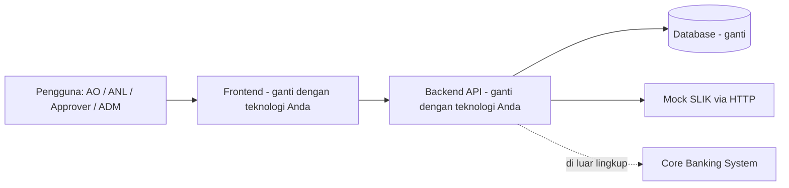
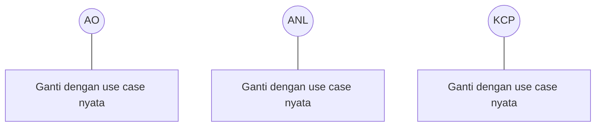
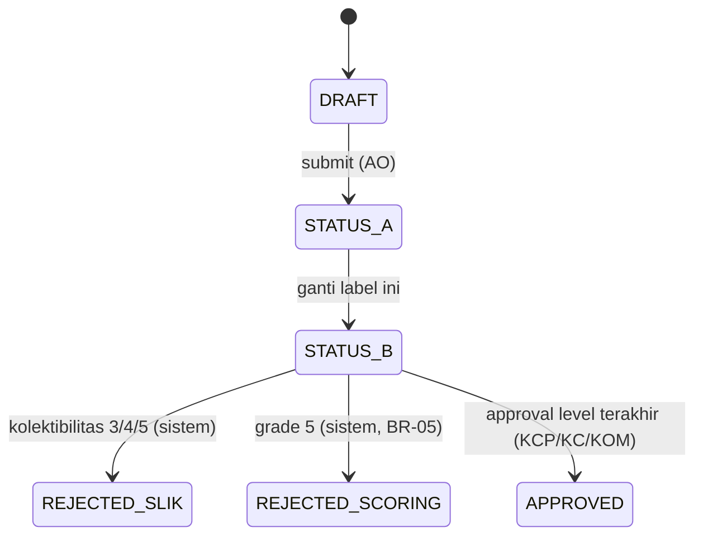

# SRS — iMitra (Sistem Originasi Pembiayaan Mikro Syariah)

> ## Baca ini dulu
>
> **1. Ini versi RINGKAS turunan brief hackathon, bukan SRS penuh.** Target maksimal
> **3 halaman**. Jangan habiskan waktu di sini — nilai terbesar ada di kode yang jalan,
> `AI-DEVLOG.md`, dan `AGENTS.md`. Alokasi waktu yang wajar: 30–40 menit di Sprint 0 untuk
> kerangka + BAB 3, lalu dilengkapi pada Jumat siang.
>
> **2. Menyalin brief bulat-bulat tidak berguna.** Yang bernilai di sini adalah bagian yang
> **tidak ada di brief**: batasan yang tim Anda tetapkan sendiri, asumsi yang Anda ambil,
> definisi status yang Anda pilih, dan requirement turunan yang Anda temukan sendiri.
> Untuk hal yang sudah jelas di brief, cukup rujuk nomornya.
>
> **3. DIAGRAM HARUS BENAR-BENAR ADA.** Ini kelemahan yang muncul di hampir semua tugas
> SRS/SDD di kelas ini: tulisan "lampirkan diagram di sini", "diagram terlampir", atau
> "[gambar use case]" tanpa gambar apa pun. Placeholder seperti itu **dinilai sebagai
> diagram yang tidak ada**. Mermaid inline diterima dan justru disarankan, karena ikut
> ter-render di GitHub dan bisa direview di PR. Diagram tangan yang difoto juga diterima
> selama gambarnya benar-benar ter-commit di repo dan terbaca.
>
> **4. Format ini mengikuti template SRS BSN yang sudah dipakai kelas ini** — struktur BAB
> dipertahankan supaya bisa dibandingkan dengan SRS iLoan Commercial.
>
> Ganti setiap `<!-- ISI: ... -->`. Hapus blok catatan ini sebelum tag `v1.0.0`.

**Dokumen**: Software Requirements Specification
**Sistem**: iMitra
**Tim**: iMitra Tim 1
**Versi**: `<!-- ISI: 1.0 -->`
**Tanggal**: `<!-- ISI -->`
**Penyusun**: Irgiyansyah (pemilik berkas), dengan masukan Luthfi (Tech Lead) dan Soleh (QA)

---

## BAB 1 — INTRODUCTION

### 1.1 Purpose

<!-- ISI: 3-5 baris. Untuk siapa dokumen ini, dan apa yang bisa diputuskan dengan membacanya.
     Sebutkan bahwa lingkupnya adalah rilis hackathon, bukan rilis produksi. -->

`<!-- ISI -->`

### 1.2 Scope

<!-- ISI: dua daftar yang tegas. "Termasuk" berisi FR yang tim Anda benar-benar bangun
     (rujuk BAB 3). "Tidak termasuk" mengambil dari brief §1.4: disbursement, akuntansi,
     jadwal angsuran aktual, penagihan, restrukturisasi, integrasi nyata Core Banking/SLIK
     produksi, mobile native, SSO/AD nyata, multi-tenant/currency/bahasa. Tambahkan juga
     FR yang Anda putuskan buang di Gate 3 — dan pastikan konsisten dengan README bagian 5. -->

**Termasuk dalam rilis ini**:
- `<!-- ISI -->`

**Tidak termasuk**:
- `<!-- ISI -->`

### 1.3 Definitions, Acronyms, and Abbreviations

<!-- ISI: lengkapi. Tabel di bawah sudah memuat istilah yang wajib konsisten dengan brief;
     tambahkan istilah khusus tim Anda (nama status, nama entitas). -->

| Istilah | Definisi |
|---|---|
| AO | Account Officer Mikro — membuat dan mengubah pengajuan miliknya, upload dokumen, merekam survei |
| ANL | Analis Mikro — verifikasi dokumen, SLIK check, skoring & override, perhitungan margin |
| KCP | Kepala Cabang Pembantu — approval level 1 |
| KC | Kepala Cabang — approval level 2 |
| KOM | Komite Pembiayaan — approval level 3 |
| ADM | Admin — kelola pengguna dan parameter |
| SLIK | Sistem Layanan Informasi Keuangan; sumber data kolektibilitas nasabah (di sistem ini: mock) |
| Kolektibilitas | Kualitas pembiayaan nasabah, skala 1–5 |
| OTS | On-The-Spot; survei lapangan di tempat usaha nasabah |
| Majelis | Kelompok nasabah 3–10 anggota dengan tanggung renteng |
| Murabahah | Akad jual beli dengan margin |
| Musyarakah | Akad kerja sama dengan nisbah bagi hasil |
| Plafon | Batas pembiayaan yang diajukan/disetujui |
| Maker / Checker | Pembuat / penyetuju; satu orang tidak boleh keduanya pada pengajuan yang sama |
| `<!-- ISI -->` | `<!-- ISI -->` |

### 1.4 References

<!-- ISI: lengkapi. Rujukan wajib ada supaya jelas dari mana requirement diturunkan. -->

| Dokumen | Keterangan |
|---|---|
| Brief Hackathon iMitra | Sumber utama seluruh requirement, aturan bisnis, dan acceptance criteria |
| SRS & SDD iLoan Commercial | Acuan domain dan acuan format (produk saudara, segmen korporat) |
| `AGENTS.md` | Aturan repo untuk AI agent, termasuk daftar BR-01…BR-12 |
| `docs/adr/` | Keputusan arsitektur |
| `<!-- ISI -->` | `<!-- ISI -->` |

---

## BAB 2 — OVERALL DESCRIPTION

### 2.1 Product Perspective

<!-- ISI: posisi iMitra terhadap sistem lain. Sebutkan bahwa SLIK adalah layanan eksternal
     yang di rilis ini diwakili mock, dan Core Banking berada di luar lingkup.
     WAJIB ADA DIAGRAM KONTEKS. Contoh kerangka Mermaid di bawah — ganti isinya dengan
     komponen nyata Anda, jangan biarkan seperti ini. -->



### 2.2 Product Functions

<!-- ISI: ringkasan alur utama dalam 6-10 baris atau satu diagram alur.
     Alur: pengajuan (AO) -> verifikasi dokumen (ANL) -> survei lapangan (AO)
     -> SLIK check (ANL) -> skoring (ANL) -> margin/nisbah (ANL) -> approval berjenjang
     (KCP/KC/KOM) -> audit trail. Diagram alur status sangat membantu di gate; kalau Anda
     membuatnya, letakkan versi rincinya di SDD BAB 3 dan cukup ringkasannya di sini. -->

`<!-- ISI -->`

### 2.3 User Characteristics

<!-- ISI: siapa penggunanya dan apa implikasinya ke desain. Yang penting untuk iMitra:
     AO bekerja di lapangan (koneksi tidak stabil, layar kecil), approver hanya perlu
     melihat yang berada di levelnya, ADM tidak menyentuh kode untuk mengubah parameter. -->

| Aktor | Karakteristik | Implikasi desain |
|---|---|---|
| AO | `<!-- ISI -->` | `<!-- ISI -->` |
| ANL | `<!-- ISI -->` | `<!-- ISI -->` |
| KCP / KC / KOM | `<!-- ISI -->` | `<!-- ISI -->` |
| ADM | `<!-- ISI -->` | `<!-- ISI -->` |

### 2.4 Constraints

<!-- ISI: batasan yang mengikat desain. Ambil dari brief §7.2 (satu perintah menjalankan,
     backend/frontend terpisah, mock SLIK layanan terpisah via HTTP, skema dari migrasi,
     seed dari skrip, otorisasi server-side, tanpa secret di repo, CI hijau) dan tambahkan
     batasan tim Anda (waktu 9 jam, keahlian, jumlah anggota). -->

- `<!-- ISI -->`

### 2.5 Assumptions and Dependencies

<!-- ISI: asumsi yang Anda ambil dan yang tidak dinyatakan di brief. Ini bagian yang paling
     bernilai di BAB 2, karena inilah keputusan tim Anda sendiri.
     Contoh hal yang perlu diasumsikan:
     - Bagaimana angsuran bulanan dihitung untuk komponen kapasitas bayar (§4.4 menyebut
       rasio angsuran bulanan, tetapi rumus angsurannya tidak diberikan) — asumsi Anda?
     - Satuan margin usaha 30 % dan 25 hari kerja: tetap atau parameter?
     - Apakah satu nasabah bisa punya lebih dari satu pengajuan aktif?
     - Zona waktu yang dipakai untuk YYYYMMDD pada nomor referensi.
     Asumsi yang ditulis bisa diperiksa; asumsi yang tidak ditulis akan jadi bug. -->

| # | Asumsi | Dampak kalau asumsi salah |
|---|---|---|
| A-1 | `<!-- ISI -->` | `<!-- ISI -->` |
| A-2 | `<!-- ISI -->` | `<!-- ISI -->` |
| A-3 | `<!-- ISI -->` | `<!-- ISI -->` |

---

## BAB 3 — FUNCTIONAL REQUIREMENTS

<!-- ISI: tabel di bawah memakai ID FR yang sama dengan brief §3 supaya bisa ditelusuri.
     Kolom Description WAJIB Anda tulis sendiri — bukan salinan kalimat brief, melainkan
     rumusan yang cukup rinci untuk diimplementasikan dan diuji: input, aturan validasi,
     hasil, dan status akhir.
     Kalau Anda menurunkan sub-requirement sendiri, beri ID turunan (FR-06.1, FR-06.2) dan
     tambahkan barisnya. Kalau ada FR yang dibuang, tulis "Dibuang — lihat README bagian 5"
     di kolom Description, jangan hapus barisnya. -->

| ID | Requirement | Actor | Description | Priority |
|---|---|---|---|---|
| FR-01 | Autentikasi & Otorisasi Berbasis Peran | Semua | `<!-- ISI -->` | P0 |
| FR-02 | Pengajuan Pembiayaan Mikro | AO | `<!-- ISI -->` | P0 |
| FR-03 | Upload & Verifikasi Dokumen | AO / ANL | `<!-- ISI -->` | P0 |
| FR-04 | Survei Lapangan (OTS) | AO | `<!-- ISI -->` | P0 |
| FR-05 | SLIK Check | ANL | `<!-- ISI -->` | P0 |
| FR-06 | Skoring Kelayakan Mikro | ANL | `<!-- ISI -->` | P0 |
| FR-07 | Perhitungan Margin / Nisbah | ANL | `<!-- ISI -->` | P0 |
| FR-08 | Approval Berjenjang | KCP / KC / KOM | `<!-- ISI -->` | P0 |
| FR-09 | Audit Trail | Sistem | `<!-- ISI -->` | P0 |
| FR-10 | Pembiayaan Kelompok (Majelis) | AO | `<!-- ISI -->` | P1 |
| FR-11 | Notifikasi Perubahan Status | Sistem | `<!-- ISI -->` | P1 |
| FR-12 | Dashboard Pipeline | AO / ANL / Approver | `<!-- ISI -->` | P1 |
| FR-13 | Parameter Terkonfigurasi | ADM | `<!-- ISI -->` | P1 |
| FR-14 | Simulasi angsuran & proyeksi bagi hasil | ANL | `<!-- ISI -->` | P2 |
| FR-15 | Ekspor daftar pengajuan ke CSV | ANL / Approver | `<!-- ISI -->` | P2 |
| FR-16 | Mode draft offline untuk AO | AO | `<!-- ISI -->` | P2 |
| FR-17 | Deteksi lokasi palsu pada survei | Sistem | `<!-- ISI -->` | P2 |
| FR-18 | Laporan Turn-Around Time | ADM / Approver | `<!-- ISI -->` | P2 |

### 3.1 Diagram Use Case

<!-- ISI: WAJIB ADA GAMBAR. Mermaid diterima. Yang penting terlihat: enam aktor
     (AO/ANL/KCP/KC/KOM/ADM) dan use case utama, bukan seluruh 18 FR.
     Hapus contoh di bawah dan gambar milik Anda. -->



### 3.2 Diagram Transisi Status Pengajuan

<!-- ISI: WAJIB ADA GAMBAR. Ini diagram yang paling sering ditanya di gate, karena ia
     memaksa Anda memutuskan status apa saja yang ada dan siapa yang memicu transisinya.
     Wajib memuat status dari brief: DRAFT, REJECTED_SLIK, REJECTED_SCORING, APPROVED,
     plus status transisi milik Anda sendiri. Setiap panah diberi label pemicu + aktor
     (BR-10: tidak ada transisi tanpa aktor dan timestamp).
     Hapus contoh di bawah dan gambar milik Anda. -->

Catatan: di dalam blok Mermaid jangan pakai `<!-- ISI -->`, karena akan merusak render.
Ganti nama `STATUS_A`, `STATUS_B`, dan seterusnya dengan nama status Anda.



---

## BAB 4 — NON-FUNCTIONAL REQUIREMENTS

<!-- ISI: jangan menyalin daftar NFR generik. Tulis yang bisa diperiksa dalam konteks
     hackathon ini, dengan angka. NFR yang tidak bisa diverifikasi tidak menambah nilai.
     Kolom "Cara verifikasi" adalah kolom terpenting. -->

| ID | Kategori | Requirement | Cara verifikasi |
|---|---|---|---|
| NFR-01 | Deployability | `<!-- ISI: mis. seluruh sistem hidup dengan satu perintah dari clone bersih -->` | `<!-- ISI -->` |
| NFR-02 | Keamanan otorisasi | `<!-- ISI: setiap endpoint memeriksa peran di server -->` | `<!-- ISI: AC-02 + test otomatis -->` |
| NFR-03 | Perlindungan data pribadi | `<!-- ISI: BR-11 — NIK & foto tidak muncul di log, pesan error, URL -->` | `<!-- ISI: mis. inspeksi log setelah menjalankan skenario demo -->` |
| NFR-04 | Ketahanan integrasi | `<!-- ISI: timeout SLIK, 503, 404 ditangani tanpa crash dan tanpa asumsi bersih -->` | `<!-- ISI -->` |
| NFR-05 | Auditability | `<!-- ISI: audit trail append-only -->` | `<!-- ISI: AC-13 dari daftar route -->` |
| NFR-06 | Konfigurabilitas | `<!-- ISI: parameter diubah tanpa deploy ulang -->` | `<!-- ISI: AC-15 -->` |
| NFR-07 | Kinerja | `<!-- ISI: angka yang realistis dan bisa diukur -->` | `<!-- ISI -->` |
| NFR-08 | Usability AO di lapangan | `<!-- ISI -->` | `<!-- ISI -->` |

---

## BAB 5 — EXTERNAL INTERFACE REQUIREMENTS

### 5.1 User Interfaces

<!-- ISI: daftar layar per peran, bukan mockup. Satu baris per layar cukup.
     Rinciannya ada di SDD BAB 6. -->

| Layar | Peran yang berhak | Fungsi utama |
|---|---|---|
| `<!-- ISI -->` | `<!-- ISI -->` | `<!-- ISI -->` |

### 5.2 Software Interfaces — Mock SLIK

Kontrak berikut mengikat dan tidak boleh diubah (brief §6.1):

```
POST /slik/inquiry
Content-Type: application/json

Request : { "nik": "3404xxxxxxxxxxxx" }
Response 200:
{
  "nik": "3404xxxxxxxxxxxx",
  "nama": "…",
  "kolektibilitas": 1,
  "jumlahFasilitasAktif": 2,
  "totalBakiDebet": 15000000,
  "tanggalData": "2026-08-20",
  "referenceId": "SLIK-…"
}
Response 404: { "error": "NIK_NOT_FOUND" }
Response 503: { "error": "SERVICE_UNAVAILABLE" }
```

<!-- ISI: lengkapi keputusan implementasi Anda:
     - timeout yang dipakai (nilai + dari mana dibaca)
     - perilaku sistem pada timeout, 503, dan 404 — masing-masing berbeda
     - bagaimana 503 dipaksa untuk keperluan demo
     - apakah hasil SLIK di-cache, dan bagaimana BR-04 (masa berlaku 30 hari) ditegakkan -->

| Situasi | Perilaku sistem iMitra | Status pengajuan setelahnya |
|---|---|---|
| 200, kolektibilitas 1 | `<!-- ISI -->` | `<!-- ISI -->` |
| 200, kolektibilitas 2 | `<!-- ISI: lanjut, grade minimal 3, wajib catatan analis -->` | `<!-- ISI -->` |
| 200, kolektibilitas 3/4/5 | `<!-- ISI: penolakan otomatis -->` | `REJECTED_SLIK` |
| 404 NIK_NOT_FOUND | `<!-- ISI -->` | `<!-- ISI -->` |
| 503 SERVICE_UNAVAILABLE | `<!-- ISI -->` | `<!-- ISI -->` |
| Timeout | `<!-- ISI -->` | `<!-- ISI -->` |
| Hasil > 30 hari (BR-04) | `<!-- ISI -->` | `<!-- ISI -->` |

### 5.3 Hardware / Communication Interfaces

<!-- ISI: singkat. Protokol (HTTP/JSON), port, dan hal terkait geotag survei
     (dari mana koordinat diperoleh, format penyimpanannya). -->

`<!-- ISI -->`

---

## BAB 6 — BUSINESS RULES

Aturan berikut diambil dari brief §4 dan **tidak boleh diubah nilainya**. Kolom
"Implementasi" Anda isi sendiri; ia harus konsisten dengan `AGENTS.md` bagian 5 dan
`docs/TRACEABILITY.md`.

| ID | Aturan | Implementasi (modul / berkas) |
|---|---|---|
| BR-01 | Plafon < Rp 5.000.000 atau > Rp 500.000.000 ditolak saat submit dengan pesan yang menjelaskan batas | `<!-- ISI -->` |
| BR-02 | Approval berurutan; level 2 tidak dapat memutuskan sebelum level 1 `APPROVE` | `<!-- ISI -->` |
| BR-03 | Skoring butuh semua dokumen wajib `VERIFIED` + minimal satu survei `VALID` + SLIK sudah dijalankan | `<!-- ISI -->` |
| BR-04 | Hasil SLIK berlaku 30 hari; lewat itu ditandai perlu SLIK ulang | `<!-- ISI -->` |
| BR-05 | Grade 5 tidak dapat diajukan ke approval; `REJECTED_SCORING` | `<!-- ISI -->` |
| BR-06 | Margin/nisbah di luar rentang grade diblokir, bukan diperingatkan | `<!-- ISI -->` |
| BR-07 | Skor akhir = Σ(skor komponen × bobot) ÷ Σ bobot, dibulatkan ke bilangan bulat terdekat | `<!-- ISI -->` |
| BR-08 | Rincian per komponen ditampilkan ke ANL dan disimpan bersama hasil skoring | `<!-- ISI -->` |
| BR-09 | Maker tidak boleh menjadi approver pada pengajuan yang sama; ditegakkan di server | `<!-- ISI -->` |
| BR-10 | Setiap perubahan status punya aktor dan timestamp | `<!-- ISI -->` |
| BR-11 | NIK dan foto dokumen tidak boleh muncul di log, pesan error, atau URL | `<!-- ISI -->` |
| BR-12 | Nomor referensi `IMT-YYYYMMDD-NNNN` unik dan tidak pernah dipakai ulang | `<!-- ISI -->` |

### 6.1 Tabel Parameter

Ketiga tabel parameter (ambang approval §4.1, keluaran kolektibilitas §4.2, rentang margin
per grade §4.3) dan komponen skor (§4.4) **wajib tersimpan sebagai data**, bukan konstanta.
Nilai lengkapnya ada di `AGENTS.md` bagian 5.1 — jangan diduplikasi di sini supaya tidak
ada dua versi yang berbeda.

<!-- ISI: yang perlu ditulis di sini hanyalah pemetaan ke tabel database Anda:
     nama tabel, siapa yang boleh mengubah (ADM), dan bagaimana perubahan berlaku tanpa
     restart (AC-15). -->

| Kelompok parameter | Nama tabel | Yang boleh mengubah | Cara perubahan berlaku |
|---|---|---|---|
| Bobot & aturan komponen skor | `<!-- ISI -->` | ADM | `<!-- ISI -->` |
| Ambang approval per plafon | `<!-- ISI -->` | ADM | `<!-- ISI -->` |
| Rentang margin/nisbah per grade | `<!-- ISI -->` | ADM | `<!-- ISI -->` |

---

## BAB 7 — ACCEPTANCE CRITERIA

Kriteria berikut diambil persis dari brief §5 dan menjadi dasar test otomatis serta
`docs/DEMO-SCRIPT.md`. Kolom "Cara diuji" Anda isi: nama berkas test otomatis, atau
"manual — DEMO-SCRIPT baris AC-xx".

| ID | Kriteria | FR terkait | Cara diuji |
|---|---|---|---|
| AC-01 | AO login, membuat pengajuan Rp 30.000.000 murabahah, mendapat nomor referensi format `IMT-YYYYMMDD-NNNN` | FR-01, FR-02 | `<!-- ISI -->` |
| AC-02 | AO tidak dapat mengakses layar verifikasi dokumen — dan panggilan API langsung ke endpoint verifikasi mengembalikan 403, bukan 200 | FR-01 | `<!-- ISI -->` |
| AC-03 | ANL menolak dokumen KTP dengan kode alasan; AO mengunggah ulang hanya KTP; data pengajuan lain tidak hilang | FR-03 | `<!-- ISI -->` |
| AC-04 | Pengajuan tanpa survei valid ditolak saat mencoba masuk skoring, dengan pesan yang menyebut BR-03 | FR-04, BR-03 | `<!-- ISI -->` |
| AC-05 | Nasabah dengan SLIK kolektibilitas 4 otomatis berstatus `REJECTED_SLIK` tanpa melalui approval | FR-05, Tabel 4.2 | `<!-- ISI -->` |
| AC-06 | Nasabah dengan SLIK kolektibilitas 2 dapat lanjut, tetapi grade risikonya tidak pernah lebih baik dari 3 | FR-05, FR-06 | `<!-- ISI -->` |
| AC-07 | Skoring menampilkan rincian keempat komponen beserta bobot dan skor komponennya | FR-06, BR-08 | `<!-- ISI -->` |
| AC-08 | ANL override grade dari 2 ke 3; sistem menolak jika alasan kosong; setelah diisi, override tercatat di audit trail dengan identitas ANL | FR-06, FR-09 | `<!-- ISI -->` |
| AC-09 | Margin 10,0 % untuk grade 1 (di bawah batas 11,0 %) diblokir sistem | FR-07, BR-06 | `<!-- ISI -->` |
| AC-10 | Pengajuan Rp 30.000.000 hanya butuh approval KCP; Rp 120.000.000 butuh KCP lalu KC; KC tidak bisa memutuskan sebelum KCP | FR-08, BR-01, BR-02 | `<!-- ISI -->` |
| AC-11 | Pengguna yang membuat pengajuan tidak bisa menyetujuinya sendiri, meski perannya memungkinkan | FR-08, BR-09 | `<!-- ISI -->` |
| AC-12 | Audit trail menampilkan riwayat lengkap satu pengajuan dari `DRAFT` sampai `APPROVED`, urut waktu, dengan aktor di setiap baris | FR-09 | `<!-- ISI -->` |
| AC-13 | Tidak ada endpoint yang bisa mengubah atau menghapus baris audit trail | FR-09 | `<!-- ISI -->` |
| AC-14 | *(P1)* Pengajuan kelompok 4 anggota, total Rp 240.000.000, membutuhkan 3 level. Setelah satu anggota Rp 60.000.000 ditolak, total jadi Rp 180.000.000 dan level yang diperlukan turun menjadi 2 | FR-10 | `<!-- ISI -->` |
| AC-15 | *(P1)* ADM mengubah bobot komponen "Lama usaha" dari 20 ke 25; skoring berikutnya memakai bobot baru tanpa restart aplikasi | FR-13 | `<!-- ISI -->` |

---

## Riwayat Revisi

<!-- ISI: SRS yang tidak pernah direvisi selama 2 hari kerja biasanya berarti ia tidak dipakai. -->

| Versi | Tanggal | Oleh | Perubahan |
|---|---|---|---|
| `<!-- ISI -->` | `<!-- ISI -->` | `<!-- ISI -->` | Versi awal |
